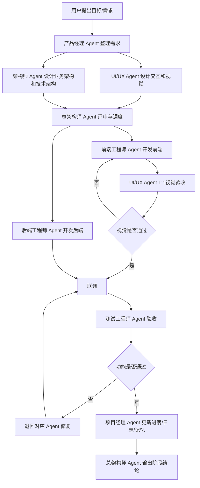

# 多 Agent 软件开发流水线整体运行流程

## 1. 总流程

## 2. 单需求运行流程

1. 产品经理 Agent 把零散需求整理为需求卡。
2. UI/UX Agent 补充交互、状态和效果图需求。
3. 架构师 Agent 输出技术设计、接口契约和数据模型。
4. 总架构师 Agent 拆分前端、后端、测试任务。
5. 项目经理 Agent 建立任务状态和排期。
6. 前端工程师 Agent 与后端工程师 Agent 并行开发。
7. 涉及 UI 的前端任务必须先由 UI/UX Agent 做 1:1 视觉验收。
8. UI/UX Agent 未通过时，任务退回前端工程师 Agent 返工。
9. UI/UX Agent 通过后，双方根据接口契约联调。
10. 测试工程师 Agent 执行功能、集成和回归验收。
11. 项目经理 Agent 更新日志、记忆和进度。
12. 总架构师 Agent 做最终交付确认。

## 3. Agent 调度规则

- 需求不清晰时，先调产品经理 Agent。
- 界面和体验不清晰时，调 UI/UX Agent。
- 技术边界不清晰时，调架构师 Agent。
- 需要代码实现时，调前端或后端工程师 Agent。
- 涉及 UI 的代码实现完成后，必须先调 UI/UX Agent 做 1:1 视觉验收。
- UI/UX Agent 未通过的 UI 任务，项目经理 Agent 必须保持阻塞，不得进入测试或下一轮开发。
- 功能完成后，必须调测试工程师 Agent。
- 任务状态变化后，必须调项目经理 Agent。
- 发生跨模块冲突时，升级给总架构师 Agent。

## 4. 完成定义

一个需求完成必须满足：

- PRD 或需求卡已更新。
- 交互和 UI 状态已明确。
- 涉及 UI 的暗色 / 白天效果图已成对存在。
- 架构和接口边界已明确。
- 前后端实现完成。
- UI/UX Agent 1:1 视觉验收通过。
- 测试验收通过。
- 进度、日志、记忆已更新。
