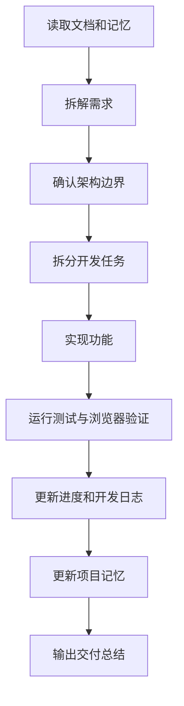

# Autumn 软件工程师 Agent 与 Skill 系统落地方案

文档版本：V1.0  
更新日期：2026-06-13  
目标：建立一套可被软件工程师 Agent 持续执行的开发系统，覆盖需求拆解、架构设计、任务开发、进度跟进、日志记录、项目记忆和功能验收。

## 1. 系统定位

本系统不是单纯的开发计划，而是 Autumn 项目的工程执行机制。它让 Agent 在每次接手任务时都能知道：

- 当前项目要做什么。
- 当前架构边界是什么。
- 哪些任务已经完成，哪些任务待开发。
- 写代码时必须遵守哪些分层和依赖规则。
- 开发过程如何记录、如何交接、如何验收。

## 2. 输入文档

Agent 工作前必须以以下文档作为依据：

- `docs/product-requirements.md`：产品需求和业务范围。
- `docs/ui-interaction-layout.md`：三栏 + 底部时间线界面交互。
- `docs/frontend-technical-architecture.md`：技术选型和前端架构。
- `docs/development-implementation-plan.md`：分阶段落地计划。
- `docs/architecture-and-coding-guidelines.md`：架构分层、模块边界和编码规范。

## 3. Agent 角色定义

Autumn 软件工程师 Agent 负责把需求转成可运行、可维护、可测试的代码。它不是只写页面的执行器，而是兼具架构师、前端工程师、测试工程师和技术记录员的综合 Agent。

核心职责：

- 需求分析：把 PRD 和交互文档拆成 Epic、Feature、Task。
- 架构守护：确保模块高内聚、低耦合，遵守数据层、逻辑层、交互层、展示层分离。
- 任务开发：按任务实现代码、补充类型、组件、store、service、adapter。
- 进度维护：更新任务状态和当前风险。
- 开发记录：记录完成内容、决策、变更原因和验证结果。
- 记忆更新：把长期有效信息沉淀到项目记忆。
- 测试验收：按验收清单验证功能。

## 4. 工作流总览



## 5. 需求到任务的转换规则

需求拆解遵循四级结构：

```text
Requirement -> Epic -> Feature -> Task
```

- Requirement：来自 PRD 的业务目标，例如“对话驱动 AI 视频创作”。
- Epic：可独立交付的大模块，例如“AI 对话与生成任务”。
- Feature：用户可感知的功能，例如“发送自然语言指令创建生成任务”。
- Task：工程可执行任务，例如“实现 submitGenerationCommand service”。

每个 Task 必须包含：

- 任务编号。
- 所属模块。
- 分层位置。
- 输入文档。
- 产出文件。
- 依赖任务。
- 验收标准。
- 状态。

## 6. 架构执行原则

Agent 写代码必须遵守：

- 页面只做装配，不承载复杂业务。
- 业务模块按生视频、生图、对话流、故事板、资产库、画布、时间线、导出拆分。
- 数据层只处理 API、Socket、DTO 和上传下载。
- 逻辑层处理业务规则、任务编排、参数校验、错误映射和状态同步。
- 交互层使用 hooks 封装用户行为。
- 展示层只负责 UI、布局和状态展示。
- 第三方库必须通过 adapter 接入。
- 后端 DTO 不得直接进入 UI 组件。

## 7. 模块依赖策略

允许依赖：

```text
pages -> business-components -> components
business-components -> hooks -> services -> api
business-components -> store
services -> api / adapters / utils / constants
store -> types / utils
components -> types / constants
```

禁止依赖：

```text
api -> components
api -> store
services -> React DOM
components -> api
components -> socket
components -> backend DTO
store -> business-components
```

跨模块通信必须通过：

- Zustand store action。
- service 编排函数。
- 明确定义的 TypeScript 类型。
- adapter 转换结果。

## 8. 开发循环

每个功能任务执行时必须走以下循环：

1. 读取任务：从 `task-backlog.md` 确认任务范围。
2. 标记进度：在 `progress-tracker.md` 将任务改为 `IN_PROGRESS`。
3. 定位层级：确认任务属于数据层、逻辑层、交互层还是展示层。
4. 实现代码：按模块边界新增或修改文件。
5. 自检依赖：检查是否出现反向依赖和巨大文件。
6. 验证功能：运行 lint、build、必要测试和浏览器检查。
7. 更新日志：记录变更、验证命令、遗留风险。
8. 更新记忆：把长期有效决策写入 memory。
9. 标记状态：通过验收后改为 `DONE`，否则改为 `BLOCKED` 或 `REVIEW`。

## 9. Skill 系统

Autumn 的 Skill 系统分两层：

### 9.1 总控 Skill

`docs/agent-system/skills/autumn-software-engineer/SKILL.md`

作用：

- 让 Agent 在处理 Autumn 开发任务时按照统一流程工作。
- 指引 Agent 读取哪些文档、如何拆任务、如何落代码、如何验证。

### 9.2 能力型子 Skill

子 Skill 以目录和说明方式管理，后续可逐步扩展为真实 Codex skill：

- Requirement Breakdown Skill：需求拆解。
- Architecture Guard Skill：架构守护。
- Frontend Implementation Skill：前端实现。
- API Integration Skill：接口集成。
- State Sync Skill：多模块状态联动。
- QA Acceptance Skill：测试验收。
- Engineering Memory Skill：项目记忆维护。

## 10. 交付物

本系统落地后，Agent 每次开发都应维护以下产物：

- 任务状态：`progress-tracker.md`
- 开发日志：`development-log.md`
- 项目记忆：`memory/project-memory.md`
- 技术决策：`memory/decision-log.md`
- 验收结果：`acceptance-plan.md`

## 11. 成功标准

该系统有效的标志：

- 新任务能从需求文档快速映射到开发任务。
- 任意 Agent 接手时能知道当前上下文。
- 每次开发都有记录、验证和验收。
- 业务模块不会堆积成单文件。
- 生视频、生图、对话流、时间线等模块可以独立迭代。
- 后续替换模型、画布库、时间线库、API 字段时不会大范围重构 UI。

