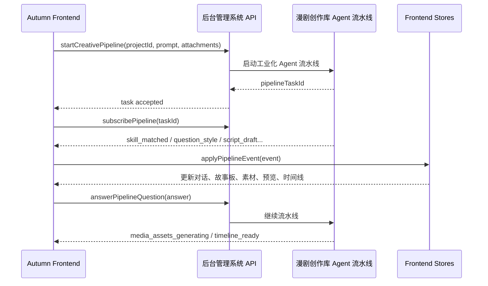

# 后台漫剧创作库 Agent 流水线接入方案

文档版本：V1.0  
更新日期：2026-06-14  
适用项目：Autumn 前端工程  
定位：明确 Autumn 前端与后台管理系统中“漫剧创作库工业化自动流水线 Agent 体系”的边界、接口职责和状态映射。

## 1. 核心结论

Autumn 前端不实现生成视频的真正内核。

真正的剧本拆解、规格生成、故事板生成、素材生产、音频生产、镜头视频生产、时间线合成和成片导出，依托已经接入后台管理系统的“漫剧创作库工业化自动流水线 Agent 体系”。

前端职责是：

- 创建项目和采集创作需求。
- 展示对话式创作过程。
- 调用后台流水线任务接口。
- 订阅后台流水线进度事件。
- 将后台产物映射为故事板、素材、预览、时间线和文档。
- 支持用户对流水线阶段进行确认、修改、重试、停止和导出。
- 支持用户切换 Agent 数据包，并区分后台账号级数据包与本地设备级数据包。
- 支持用户启用 / 停用 Skill，并区分数据包内置 Skill、后台账号级 Skill、本地设备级 Skill。

## 2. 系统边界

```text
Autumn Frontend
  -> Pipeline API Adapter
  -> 后台管理系统 API / Socket
  -> 漫剧创作库工业化 Agent 流水线
  -> 后台项目 / 素材 / 任务 / 文档 / 导出数据
  -> Autumn Frontend 状态回显
```

## 3. 前端不得实现的能力

- 不在前端拆解完整剧本生产逻辑。
- 不在前端实现多 Agent 生产调度。
- 不在前端直接调用底层模型。
- 不在前端编排镜头视频生成内核。
- 不在前端实现素材搜索、资产配置和视频合成内核。
- 不把后台流水线 DTO 直接扩散到 UI 组件。

## 4. 前端必须实现的能力

| 能力 | 前端职责 | 后台流水线职责 |
| --- | --- | --- |
| 创作需求提交 | 采集 prompt、附件、项目配置 | 解析需求并启动 Agent 流水线 |
| 问题确认 | 展示问题卡、收集选项 | 根据答案推进流水线 |
| 剧本确认 | 展示草稿、收集确认/修改意见 | 重写或进入生产阶段 |
| 规格文档 | 展示 Markdown / 易读视图 | 生成和保存规格文档 |
| 故事板 | 展示关键元素、分镜、旁白音乐 | 生成故事板结构和镜头元数据 |
| 素材生成 | 展示进度、预览素材 | 生产图片、音频、视频素材 |
| 镜头视频 | 展示生成进度和预览 | 调度视频模型生成镜头片段 |
| 时间线 | 展示多轨结构和片段 | 输出可合成的时间线数据 |
| 导出 | 提交导出请求、显示进度 | 合成成片并返回下载链接 |

## 5. 前端接入模块

建议新增以下前端模块：

```text
src/api/pipeline/
├── pipelineApi.ts          # REST 任务接口
├── pipelineSocket.ts       # Socket 进度订阅
└── pipelineDto.ts          # 后台流水线 DTO 类型

src/adapters/pipeline/
├── mapPipelineProject.ts
├── mapPipelineChatEvent.ts
├── mapPipelineAsset.ts
├── mapPipelineStoryboard.ts
├── mapPipelineTimeline.ts
└── mapPipelineTask.ts

src/services/pipeline/
├── startCreativePipeline.ts
├── answerPipelineQuestion.ts
├── confirmPipelineScript.ts
├── stopPipelineTask.ts
├── retryPipelineStage.ts
└── applyPipelineEvent.ts

src/store/
├── pipelineStore.ts
├── chatFlowStore.ts
├── generationTaskStore.ts
├── agentPackageStore.ts
└── workspaceStore.ts
```

## 5.1 Agent 数据包接入模块

```text
src/api/agent-packages/
├── agentPackageApi.ts
└── agentPackageDto.ts

src/adapters/agent-packages/
└── mapAgentPackage.ts

src/services/agent-packages/
└── importLocalAgentPackage.ts
```

```text
src/api/skills/
├── skillLibraryApi.ts
└── skillLibraryDto.ts

src/adapters/skills/
└── mapSkillLibraryItem.ts

src/services/skills/
└── importLocalSkill.ts
```

Agent 数据包来源：

| 来源 | 前端标识 | 存储作用域 | 同步策略 |
| --- | --- | --- | --- |
| 后台导入 | `source=backend` | `storageScope=account` | 跟随账号同步，可多设备使用 |
| 本地导入 | `source=local` | `storageScope=device` | 仅当前设备可用，不上传后台，不进入账号同步 |

本地导入的数据包只作为前端工作台配置参与展示、切换和参数预设，不允许绕过后台管理系统直接调用生成模型或视频生成内核。

## 5.2 Skill 库接入模块

| 来源 | 前端标识 | 存储作用域 | 同步策略 |
| --- | --- | --- | --- |
| 数据包内置 Skill | `source=agentPackage` | 跟随数据包 | 跟随数据包 |
| 后台导入 Skill | `source=backend` | `storageScope=account` | 跟随账号同步，可多设备使用 |
| 本地导入 Skill | `source=local` | `storageScope=device` | 仅当前设备可用，不上传后台，不进入账号同步 |

用户启用的 Skill 集合应在启动或推进流水线时传给后台，由后台漫剧创作库流水线决定实际执行策略。

## 6. 流水线阶段映射

| 后台流水线阶段 | 前端状态 | UI 表现 |
| --- | --- | --- |
| `skill_matched` | `CF-01` | Skill 匹配完成结果卡 |
| `question_style` | `CF-02` | 风格确认问题卡 |
| `question_duration` | `CF-03` | 时长确认问题卡 |
| `script_draft_ready` | `CF-04` | 剧本草稿消息 |
| `script_confirmation` | `CF-05` | 脚本确认卡 |
| `media_assets_generating` | `CF-06` / `MG-01` | 媒体资产生成进度 |
| `video_spec_ready` | `PW-02` | 规格文档视图 |
| `storyboard_ready` | `PW-03` | 故事板概览 |
| `asset_preview_ready` | `PW-04` / `MG-02` | 角色 / 场景预览 |
| `audio_ready` | `PW-05` / `MG-03` | 音频播放器 |
| `shot_script_ready` | `MG-04` | 分镜脚本卡片 |
| `shot_video_generating` | `MG-05` | 镜头视频生成中 |
| `timeline_ready` | `MG-06` | 成片预览 / 时间线 |
| `export_ready` | `ExportDone` | 下载成片 |

## 7. 事件流



## 8. 数据适配原则

- 后台 DTO 只允许出现在 `api/pipeline` 和 `adapters/pipeline`。
- UI 只消费前端领域模型，例如 `ChatMessage`、`StoryboardElement`、`AssetItem`、`TimelineTrack`。
- 后台阶段名必须通过 adapter 映射成前端状态枚举。
- 进度事件必须可幂等处理，避免 Socket 重放导致重复卡片。
- 失败事件必须带上可重试阶段和用户友好文案。

## 9. Sprint 0 落地要求

Sprint 0 先用 Mock Pipeline 实现同样的事件序列：

```text
skill_matched
question_style
question_duration
script_draft_ready
script_confirmation
video_spec_ready
storyboard_ready
media_assets_generating
asset_preview_ready
audio_ready
shot_script_ready
shot_video_generating
timeline_ready
```

后续联调时只替换 `pipelineApi` 与 `pipelineSocket`，UI、store、service 和 adapter 不需要重写。
