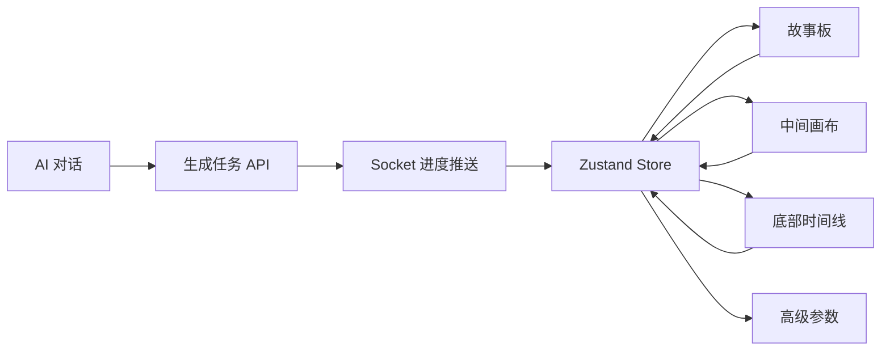

# Autumn 开发计划实施方案

文档版本：V1.0  
更新日期：2026-06-13  
适用项目：Autumn 前端工程  
产品形态：VidFlow AI / Flova.ai 复刻版对话式 AI 视频创作平台  

## 1. 建设目标

Autumn 项目当前已完成 React 18 + TypeScript 5.x + Vite 6 的基础脚手架。本实施方案用于把 PRD、界面交互布局文档、前端技术架构文档落到可执行开发计划中，目标是交付一个以“左中右三栏 + 底部时间线”为核心的 AI 视频创作工作台。

核心体验目标：

- 用自然语言驱动视频创作，形成“对话指令 -> AI 拆解 -> 分镜生成 -> 时间线排布 -> 导出”的闭环。
- 将资产库、故事板、画布预览、AI 对话、高级参数、底部时间线绑定为同一数据源。
- 复用现有后台管理系统的接口、账户系统、用户系统、模型配置系统和后台服务能力，前端只新增创作端工作台能力。
- 优先完成 MVP 可用闭环，再迭代角色一致性、风格一致性、自动字幕、团队协作等高级能力。

## 2. 实施范围

### 2.1 MVP 范围

MVP 阶段需要完成以下可用能力：

- 顶部导航栏：项目入口、当前项目状态、导出入口、用户信息入口。
- 左侧栏：故事板列表、基础资产库、分镜选中、排序、删除、重生成入口。
- 中间画布：当前镜头预览、单镜头视图、基础缩放、镜头信息栏。
- 右侧栏：AI 对话消息流、指令输入、模型和生成参数面板。
- 底部时间线：视频轨、音频轨、字幕轨的基础展示，镜头片段与故事板联动。
- 接口层：对接现有后台账户、用户、模型配置、项目、资产、AI 生成任务、导出任务接口。
- 实时进度：通过 Socket 接收生成任务进度，更新故事板、画布、时间线和对话区。

### 2.2 暂缓范围

以下能力进入第二阶段或第三阶段：

- 多人协作、评论协同、权限协同。
- 高级剪辑能力：复杂转场、调色、特效、多素材混编。
- 移动端适配。
- 第三方 API 开放平台。
- 完整模板市场和商业化套餐页面。

## 3. 技术架构落地

### 3.1 当前基础栈

Autumn 已初始化：

- React 18
- TypeScript 5.x
- Vite 6
- ESLint
- VS / VS Code 友好配置

### 3.2 需要补充的生产依赖

建议在第一轮工程化改造中补齐以下依赖：

| 类型 | 依赖 | 用途 |
| --- | --- | --- |
| 路由 | react-router-dom | 项目列表、编辑器、模板库、设置页路由 |
| 状态管理 | zustand | 多面板联动的单一数据源 |
| UI 组件 | antd | 表单、弹窗、标签页、上传、进度条、下拉菜单 |
| 图标 | @ant-design/icons | 与 Ant Design 体系配套的图标 |
| HTTP | axios | REST API 请求封装 |
| 实时通信 | socket.io-client | AI 任务进度、消息推送、长连接 |
| 画布 | fabric | 圈选改图、选区坐标、画布缩放和平移 |
| 视频预览 | video.js | 视频播放、进度条、音量、全屏 |
| 时间线 | @xzdarcy/react-timeline-editor | 多轨道时间线、片段拖拽、缩放 |
| 上传 | react-dropzone | 图片、音频、视频素材拖拽上传 |
| 工具 | dayjs, lodash-es, nprogress, js-file-download | 时间格式化、防抖、加载进度、文件下载 |

### 3.3 推荐源码目录

```text
src/
├── api/
│   ├── request.ts
│   ├── auth.ts
│   ├── user.ts
│   ├── modelConfig.ts
│   ├── project.ts
│   ├── asset.ts
│   ├── storyboard.ts
│   ├── generation.ts
│   ├── timeline.ts
│   └── export.ts
├── assets/
│   ├── images/
│   └── styles/
├── business-components/
│   ├── AssetLibrary/
│   ├── Storyboard/
│   ├── CanvasEditor/
│   ├── VideoPreview/
│   ├── ChatPanel/
│   ├── ParamPanel/
│   └── TimelineEditor/
├── components/
│   ├── Common/
│   └── Layout/
├── hooks/
│   ├── useSocket.ts
│   ├── useAutoSave.ts
│   ├── useCanvasEditor.ts
│   └── useTimelineSync.ts
├── pages/
│   ├── ProjectList/
│   ├── TemplateLibrary/
│   ├── Editor/
│   └── Settings/
├── router/
├── store/
│   ├── projectStore.ts
│   ├── storyboardStore.ts
│   ├── canvasStore.ts
│   ├── timelineStore.ts
│   ├── chatStore.ts
│   ├── paramStore.ts
│   ├── assetStore.ts
│   └── userStore.ts
├── types/
│   ├── api.ts
│   ├── project.ts
│   ├── storyboard.ts
│   ├── asset.ts
│   ├── params.ts
│   ├── timeline.ts
│   └── chat.ts
└── utils/
    ├── format.ts
    ├── validate.ts
    ├── errors.ts
    └── constants.ts
```

## 4. 模块拆分与交互关系

### 4.1 全局布局

页面采用固定工作台布局：

```text
TopBar
└── EditorShell
    ├── LeftPanel: AssetLibrary / Storyboard
    ├── CenterCanvas: CanvasEditor / VideoPreview / ShotCompare
    ├── RightPanel: ChatPanel / ParamPanel
    └── BottomTimeline: TimelineEditor
```

建议首轮实现使用 CSS Grid：

- 左侧栏：25%，最小 280px，可拖拽调整。
- 中间画布：45%，最小 520px。
- 右侧栏：30%，最小 360px。
- 时间线：默认 180px，可折叠到 44px。
- 顶栏：56px 固定高度。

### 4.2 单一数据源

所有模块通过 Zustand store 联动，避免组件之间直接互相调用。



### 4.3 核心联动规则

| 操作来源 | 状态变化 | 联动结果 |
| --- | --- | --- |
| 故事板选中镜头 | `selectedShotId` 更新 | 画布显示该镜头，参数面板载入该镜头参数，时间线 playhead 移动到片段开始处 |
| 故事板拖动排序 | `shots` 顺序更新 | 时间线视频轨顺序同步，项目自动保存 |
| 对话提交指令 | 新建生成任务 | 对话区显示任务拆解，故事板新增生成中镜头，时间线新增占位片段 |
| Socket 推送进度 | 镜头状态与进度更新 | 故事板进度条、画布预览、对话进度消息同步 |
| 时间线调整片段时长 | `timeline.clips` 更新 | 对应分镜时长更新，项目总时长重新计算 |
| 参数面板修改 seed/iw/cref/sref | `generationParams` 更新 | 后续生成任务继承项目级参数，当前镜头可选择覆盖 |

## 5. 后台服务复用方案

后台继续复用现有后台管理系统服务，不重复建设账户、用户、模型配置和权限系统。前端通过统一接口层适配创作端业务。

### 5.1 复用边界

| 后台能力 | 复用方式 | 前端接入点 |
| --- | --- | --- |
| 账户系统 | 复用登录态、Token、刷新机制 | `src/api/auth.ts`, `userStore` |
| 用户系统 | 复用用户资料、头像、套餐、权限 | TopBar 用户区、导出权限判断 |
| 模型配置系统 | 复用可用模型、模型参数、价格或额度配置 | ParamPanel 模型下拉、生成参数校验 |
| 素材管理 | 复用上传、存储、文件访问权限 | AssetLibrary、cref/sref 选择器 |
| AI 任务服务 | 复用现有模型调度、任务状态、失败原因 | generation API、Socket 进度 |
| 项目管理 | 若后台已有项目表则扩展字段；没有则新增创作项目 API | ProjectList、Editor 自动保存 |
| 导出服务 | 复用后台转码、合成、下载链接 | Export 按钮、导出进度弹窗 |

### 5.2 建议接口分组

```text
GET    /api/user/profile
GET    /api/model-configs

GET    /api/projects
POST   /api/projects
GET    /api/projects/:projectId
PATCH  /api/projects/:projectId
POST   /api/projects/:projectId/snapshot

GET    /api/projects/:projectId/assets
POST   /api/projects/:projectId/assets/upload
PATCH  /api/assets/:assetId
DELETE /api/assets/:assetId

GET    /api/projects/:projectId/shots
POST   /api/projects/:projectId/shots
PATCH  /api/shots/:shotId
DELETE /api/shots/:shotId
POST   /api/shots/:shotId/regenerate

POST   /api/projects/:projectId/chat/messages
GET    /api/projects/:projectId/chat/messages

POST   /api/projects/:projectId/generation-tasks
GET    /api/generation-tasks/:taskId

GET    /api/projects/:projectId/timeline
PATCH  /api/projects/:projectId/timeline

POST   /api/projects/:projectId/export-tasks
GET    /api/export-tasks/:taskId
```

### 5.3 Socket 事件

```text
client -> server: project:join
client -> server: project:leave

server -> client: generation:created
server -> client: generation:progress
server -> client: generation:succeeded
server -> client: generation:failed
server -> client: export:progress
server -> client: export:succeeded
server -> client: export:failed
server -> client: project:saved
```

### 5.4 错误映射

统一在 `src/utils/errors.ts` 转换后端错误码：

| 后端错误 | 前端提示 |
| --- | --- |
| `Lingdong video task failed` | 视频生成任务失败，请检查参考图链接是否可访问，或调整生成参数后重试 |
| `INVALID_SEED` | Seed 值需为 0-4294967295 的整数 |
| `ASSET_NOT_ACCESSIBLE` | 参考图链接无法加载，请更换可公开访问的图片链接 |
| `MODEL_QUOTA_EXCEEDED` | 当前模型额度不足，请切换模型或检查账户套餐 |

## 6. 数据模型规划

### 6.1 核心类型

```ts
export type ShotStatus = 'pending' | 'generating' | 'completed' | 'failed';

export interface GenerationParams {
  modelId: string;
  prompt: string;
  negativePrompt?: string;
  resolution: '720p' | '1080p' | '4k' | 'custom';
  fps: 24 | 30 | 60;
  seed?: number;
  iw?: number;
  cref?: string[];
  sref?: string[];
  cw?: number;
  sw?: number;
}

export interface Shot {
  id: string;
  projectId: string;
  title: string;
  description: string;
  order: number;
  duration: number;
  status: ShotStatus;
  progress: number;
  thumbnailUrl?: string;
  videoUrl?: string;
  modelId?: string;
  seed?: number;
  params: GenerationParams;
  errorMessage?: string;
}

export interface TimelineClip {
  id: string;
  shotId?: string;
  trackId: string;
  type: 'video' | 'audio' | 'subtitle';
  start: number;
  duration: number;
  label: string;
  assetUrl?: string;
}
```

### 6.2 参数校验规则

| 参数 | 范围 | 校验时机 |
| --- | --- | --- |
| `seed` | 0-4294967295 整数 | 输入时、提交生成任务前 |
| `iw` | 0.5-3 | 输入时、提交生成任务前 |
| `cw` | 0-100 | 输入时、提交生成任务前 |
| `sw` | 0-1000 | 输入时、提交生成任务前 |
| `cref` | 资产库有效图片 URL 或 assetId | 选择时、提交生成任务前 |
| `sref` | 资产库有效图片 URL 或 assetId | 选择时、提交生成任务前 |

## 7. 分阶段开发计划

### 阶段 0：工程化基线，1-2 天

目标：把当前脚手架改造成可持续开发的前端工程。

任务：

- 安装并配置生产依赖：路由、Zustand、AntD、Axios、Socket、Fabric、Video.js、时间线组件。
- 建立推荐目录结构。
- 配置路径别名，例如 `@/api`、`@/store`、`@/components`。
- 建立全局主题变量和深色模式基础样式。
- 建立 `request.ts`、错误拦截器、Token 注入逻辑。
- 建立基础 Mock 数据，保证无后台时也能开发 UI。

验收：

- `npm run dev` 正常启动。
- `npm run build` 通过。
- Editor 路由可进入空工作台布局。

### 阶段 1：工作台布局，3-5 天

目标：完成三栏 + 底部时间线的页面骨架。

任务：

- 实现 `EditorShell`、`TopBar`、`LeftPanel`、`CenterCanvas`、`RightPanel`、`BottomTimeline`。
- 实现左侧 Tab：故事板 / 资产库。
- 实现右侧 Tab：对话助手 / 高级参数。
- 实现底部时间线折叠/展开。
- 实现面板最小宽度、基础拖拽调整栏宽。
- 按 PRD 配色落地深色主题。

验收：

- 1920x1080 下布局比例接近 25% / 45% / 30%，无内容重叠。
- 时间线可折叠，折叠后中间工作区高度自动扩大。
- 顶栏、左栏、中间画布、右栏、底栏都有清晰职责。

### 阶段 2：状态模型与联动底座，3-5 天

目标：建立工作台的数据骨架，让所有区域围绕同一个项目状态运作。

任务：

- 实现 `projectStore`、`storyboardStore`、`canvasStore`、`timelineStore`、`chatStore`、`paramStore`、`assetStore`。
- 定义 `Project`、`Shot`、`Asset`、`ChatMessage`、`GenerationParams`、`TimelineClip` 类型。
- 完成选中镜头联动：故事板 -> 画布 -> 参数 -> 时间线。
- 完成故事板排序联动时间线片段。
- 增加自动保存 Hook，先接 Mock API，后续替换真实 API。

验收：

- 点击故事板镜头，中间画布、参数面板、时间线高亮同步变化。
- 调整镜头顺序，时间线视频轨顺序同步。
- Store 结构独立，业务组件不直接跨层调用。

### 阶段 3：资产库与故事板，5-7 天

目标：完成左侧核心素材和分镜管理能力。

任务：

- 资产库支持分类：角色、场景、剧本、音频、视频。
- 支持上传、预览、重命名、删除、收藏。
- 支持角色参考和风格参考选择，供 `cref/sref` 使用。
- 故事板卡片展示缩略图、描述、时长、状态、进度、模型标签。
- 支持分镜新增、复制、删除、拖动排序、单镜头重生成入口。
- 支持生成失败状态与重试按钮。

验收：

- 左侧可完整展示资产和故事板。
- 分镜状态能表达 pending / generating / completed / failed。
- 失败镜头可重试，并显示友好错误提示。

### 阶段 4：AI 对话与生成任务，5-7 天

目标：完成对话驱动创作的 MVP 闭环。

任务：

- 实现消息流：用户消息、AI 回复、进度通知、结果反馈。
- 实现固定底部输入框、附件入口、发送、重生成、清空对话。
- 对接 `POST /chat/messages` 和 `POST /generation-tasks`。
- 解析后端返回的任务拆解结果，创建故事板镜头和时间线占位片段。
- 接入 Socket 任务进度事件，更新镜头状态。
- 将全局约束和项目级参数自动拼接到生成请求。

验收：

- 输入一条生成指令后，故事板新增生成中镜头。
- Socket 推送进度后，进度条、对话区、画布状态同步更新。
- 生成成功后，缩略图、视频 URL、时间线片段完成替换。

### 阶段 5：中间画布与视频预览，5-7 天

目标：实现当前镜头的主预览和基础编辑。

任务：

- 接入 Video.js 播放视频结果。
- 接入 Fabric.js 渲染图像预览层和圈选层。
- 实现单镜头视图、分镜对比视图、成片预览视图。
- 实现缩放、平移、截图保存到资产库。
- 实现圈选区域坐标导出，并通过对话指令提交局部修改任务。
- 实现镜头信息栏：分辨率、帧率、时长、模型、seed。

验收：

- 选中任一镜头，中间区域能稳定预览图片或视频。
- 圈选区域后可提交局部修改指令。
- 截图可进入资产库。

### 阶段 6：底部时间线，7-10 天

目标：完成基础视频剪辑轴和故事板同步。

任务：

- 接入 `@xzdarcy/react-timeline-editor`。
- 建立视频、音频、字幕三类轨道。
- 视频片段与 `Shot` 一一关联。
- 支持片段拖动、调整时长、删除。
- 支持播放指针、时间轴缩放、总时长计算。
- 时间线选中片段时同步选中对应故事板镜头。
- 保存时间线结构到后台。

验收：

- 故事板顺序变化能同步时间线。
- 时间线选中片段能同步画布和故事板。
- 调整片段时长后，镜头时长和项目总时长正确刷新。

### 阶段 7：项目保存与导出，5-7 天

目标：完成项目级持久化和导出成片闭环。

任务：

- 项目列表页：创建、打开、删除项目。
- 编辑器自动保存：每 30 秒保存，关键操作立即保存。
- 项目版本快照：手动保存版本，支持后续回溯。
- 导出弹窗：格式、分辨率、帧率、字幕、压缩选项。
- 对接导出任务 API 和 Socket 进度。
- 导出完成后触发文件下载或展示下载链接。

验收：

- 刷新页面后项目状态可恢复。
- 导出任务能展示进度、成功、失败。
- 导出失败有清晰原因和重试入口。

### 阶段 8：质量加固与上线准备，5-7 天

目标：提升稳定性、性能和可维护性。

任务：

- 增加关键 store、utils、参数校验的单元测试。
- 增加核心流程 E2E：新建项目 -> 发指令 -> 生成镜头 -> 调整时间线 -> 导出。
- 优化大列表和时间线渲染性能。
- 增加错误边界、空状态、加载状态、断线重连提示。
- 梳理权限控制：未登录、无额度、无模型权限、素材无权限。
- 生产环境配置：API baseURL、Socket URL、Sentry 或同类监控。

验收：

- 核心链路无阻塞级问题。
- 构建产物可部署。
- 异常场景有明确提示，不出现白屏。

## 8. MVP 排期建议

建议以 4 周完成 MVP。

| 周期 | 重点 | 交付物 |
| --- | --- | --- |
| 第 1 周 | 工程化、布局、主题、基础路由、Store 骨架 | 可打开的编辑器工作台 |
| 第 2 周 | 资产库、故事板、参数面板、基础联动 | 可管理分镜和素材 |
| 第 3 周 | 对话、生成任务、Socket 进度、画布预览 | 可通过指令生成并预览镜头 |
| 第 4 周 | 时间线、保存、导出、错误处理、测试 | 可完成端到端创作闭环 |

## 9. 测试策略

### 9.1 单元测试

优先覆盖：

- 参数校验：seed、iw、cw、sw、cref、sref。
- 错误码映射。
- 时间线时长计算。
- 故事板排序同步逻辑。
- prompt 约束拼接逻辑。

### 9.2 组件测试

优先覆盖：

- StoryboardCard 状态展示。
- ParamPanel 参数输入和校验提示。
- ChatPanel 发送按钮、附件状态、消息流。
- TimelineEditor 片段选中和拖动后的回调。

### 9.3 E2E 测试

核心用例：

1. 登录后进入项目列表。
2. 新建项目并进入编辑器。
3. 输入“生成一个仙境场景，有浮空山、瀑布、发光植物，电影质感”。
4. 故事板新增镜头，Socket 推送进度。
5. 生成完成后，中间画布显示预览。
6. 拖动时间线片段并保存。
7. 发起导出任务并收到完成状态。

## 10. 性能与体验约束

- 首屏加载目标：小于 2 秒。
- 指令提交反馈：小于 1 秒内给出任务创建状态。
- 预览切换：小于 500ms。
- 故事板和时间线更新需要防抖，避免高频拖动导致频繁保存。
- 大量素材和镜头列表需要虚拟滚动或分页。
- 视频预览资源需要懒加载，避免同时加载全部镜头视频。
- Socket 断线需要自动重连，并在右上角显示连接状态。

## 11. 风险与应对

| 风险 | 影响 | 应对 |
| --- | --- | --- |
| 后台现有接口字段与创作端需求不一致 | 前端联调阻塞 | 先定义前端 adapter 层，避免业务组件依赖原始接口字段 |
| AI 任务耗时长 | 用户误以为卡死 | 任务创建后立即插入占位镜头，持续展示进度和预计耗时 |
| 多面板状态互相覆盖 | 数据错乱 | 坚持 Store 单一数据源，所有联动通过 action 收口 |
| 时间线库能力不足 | 剪辑体验受限 | MVP 只使用基础轨道能力，高级剪辑保留替换时间线库的接口层 |
| 角色/风格一致性不稳定 | 生成结果不符合预期 | 项目级 cref/sref 继承、约束 prompt 自动拼接、失败重试保留原参数 |
| 素材权限或 URL 失效 | 生成失败 | 上传后使用后台 assetId，前端提交前检查可访问性和权限状态 |

## 12. 交付标准

MVP 完成时应满足：

- 用户能创建项目，并进入三栏 + 底部时间线的创作工作台。
- 用户能通过右侧对话输入自然语言指令并创建生成任务。
- 生成任务能在故事板、中间画布、时间线、对话区同步展示状态。
- 用户能调整分镜顺序、镜头时长，并保存项目。
- 用户能配置模型、seed、iw、cref、sref 等关键参数。
- 用户能发起导出任务并看到进度和结果。
- 所有后台错误都经过前端友好提示转换。
- `npm run lint`、`npm run build` 必须通过。

## 13. 下一步建议

优先从阶段 0 和阶段 1 开始实施：

1. 补齐依赖并建立目录结构。
2. 替换当前演示页为 `EditorShell` 工作台。
3. 先用 Mock 数据做完整三栏联动。
4. 再逐步接入真实后台接口和 Socket 事件。

这样可以让 UI、状态、接口三条线并行推进，尽早形成可点击、可联动、可验证的产品原型。
