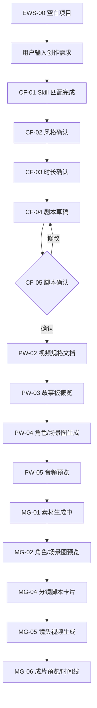

# Flova 视频创作流程状态图谱

文档版本：V1.0  
更新日期：2026-06-14  
适用项目：Autumn 前端工程  
来源：用户提供录屏与截图抽帧分析。

## 1. 分析结论

录屏展示的是一条完整的对话式 AI 视频创作链路：

```text
空白项目
  -> 输入创作需求
  -> Skill 匹配
  -> 多轮问题确认
  -> 剧本草稿
  -> 脚本确认
  -> 视频规格文档
  -> 故事板 / 关键元素
  -> 角色、场景、音频素材生成
  -> 镜头视频生成
  -> 时间线预览 / 成片预览
```



前端实现时应把该流程拆成三类状态：

- `CF-*`：右侧对话流状态。
- `PW-*`：脚本确认后的生产工作台布局状态。
- `MG-*`：媒体生成、镜头视频和时间线预览状态。

## 2. 参考资源

抽帧与截图归档：

- 视频抽帧：`src/assets/ui-references/flova-video-analysis/frames/`
- 用户截图：`src/assets/ui-references/flova-video-analysis/screenshots/`
- 抽帧总览：`src/assets/ui-references/flova-video-analysis/contact-sheets/video-frames-contact.jpg`
- 截图总览：`src/assets/ui-references/flova-video-analysis/contact-sheets/user-screenshots-contact.jpg`

生成效果图：

- 对话流状态板暗色：`src/assets/ui-mockups/20260614-chat-flow-states-dark-4k.png`
- 对话流状态板白天：`src/assets/ui-mockups/20260614-chat-flow-states-light-4k.png`
- 生产工作台状态板暗色：`src/assets/ui-mockups/20260614-production-workspace-states-dark-4k.png`
- 生产工作台状态板白天：`src/assets/ui-mockups/20260614-production-workspace-states-light-4k.png`
- 媒体生成 / 视频状态板暗色：`src/assets/ui-mockups/20260614-media-generation-video-states-dark-4k.png`
- 媒体生成 / 视频状态板白天：`src/assets/ui-mockups/20260614-media-generation-video-states-light-4k.png`

## 3. CF 对话流状态

| 状态 | 名称 | 触发 | UI 表现 | 前端组件 |
| --- | --- | --- | --- | --- |
| CF-01 | Skill 匹配完成 | 用户输入创作需求后 | 用户消息、Flova 回复、`Skill 已完成`结果卡、说明文本 | `ChatMessage`, `ResultCard` |
| CF-02 | 风格确认 1/2 | Agent 需要确认风格 | 单选问题卡、分页 `1/2`、下一步按钮、星级反馈 | `QuestionCard`, `OptionRadioGroup` |
| CF-03 | 时长确认 2/2 | 完成风格后 | 单选时长卡、分页 `2/2`、发送按钮 | `QuestionCard` |
| CF-04 | 剧本草稿 | Agent 完成剧本初稿 | 长文本草稿、分隔线、下滚按钮 | `ScriptDraftMessage` |
| CF-05 | 脚本确认 | 剧本草稿后 | 确认 / 修改剧本选项、其它输入框、发送按钮 | `ConfirmationCard` |
| CF-06 | 媒体资产生成 | 用户确认脚本后 | `Media Assets 生成中` 卡片、纵向步骤、完成/进行中状态 | `GenerationProgressCard` |

## 4. PW 生产工作台状态

| 状态 | 名称 | 主要布局 | 右侧对话 | 实现重点 |
| --- | --- | --- | --- | --- |
| PW-01 | Skill 已完成 / 空工作台 | 左故事板空态 + 中预览空态 + 中下媒体空态 + 右对话 | Skill 完成说明 | 空态仍保留右侧对话入口 |
| PW-02 | 文档 / 视频规格 | 左文档树 + 中 Markdown 文档 + 右对话 | 视频规格、故事板更新卡 | 文档视图支持易读 / Markdown 切换 |
| PW-03 | 故事板概览 | 左关键元素卡片 + 中预览空态 + 右故事板概要 | 故事板概览 | 关键元素按角色/场景/道具/配乐分类 |
| PW-04 | 角色图生成 / 音色选择 | 左元素卡选中 + 中角色图预览 + 下媒体条 + 右问题卡 | 音色建立方式选择 | 选中素材同步预览和媒体条 |
| PW-05 | 媒体资产完成 / 音频预览 | 左音频元素卡 + 中音频播放器 + 下媒体条 + 右生成结果 | 资产生成完成列表 | 音频、图片、视频统一资产卡片 |

## 5. MG 媒体生成与视频状态

| 状态 | 名称 | 主要布局 | 状态重点 |
| --- | --- | --- | --- |
| MG-01 | 素材生成中 80% | 左元素卡显示进度，中预览大进度，右生成中消息 | 支持百分比、停止生成、积分变化 |
| MG-02 | 角色 / 场景图预览 | 左元素缩略图，中大图预览，下媒体条 | 预览工具：下载、收藏、删除、HD |
| MG-03 | 音频预览 | 中央音频播放器，左/下音频卡片 | 统一音频波形、时长和播放状态 |
| MG-04 | 分镜脚本卡片 | 左分镜卡 + 中场景图 + 右生成说明 | 镜头、元素、旁白和音频绑定 |
| MG-05 | 镜头视频生成 | 中视频预览 + 底部时间线 + 右生成检查项 | 视频片段生成进度进入时间线 |
| MG-06 | 成片预览 / 时间线 | 时间线模式，视频/音频/字幕多轨 | 成片预览、播放头、缩放和轨道控制 |

## 6. 前端状态模型建议

```ts
type ChatFlowState =
  | 'skillMatched'
  | 'questionStyle'
  | 'questionDuration'
  | 'scriptDraft'
  | 'scriptConfirm'
  | 'mediaGenerating';

type ProductionWorkspaceState =
  | 'skillCompleted'
  | 'videoSpecDocument'
  | 'storyboardOverview'
  | 'assetPreview'
  | 'audioPreview'
  | 'shotVideoGenerating'
  | 'timelinePreview';

type GenerationStageStatus = 'pending' | 'running' | 'completed' | 'failed';
```

实现策略：

- 对话卡片、结果卡、问题卡、进度卡独立组件化。
- 工作台布局由 `workspaceMode` 和 `openPanels` 控制。
- 当前选中素材通过 `selectedAssetId` 联动左侧卡片、中间预览和底部媒体条。
- 当前镜头通过 `selectedShotId` 联动故事板、视频预览和时间线片段。
- 生成进度通过统一 `generationTaskStore` 管理，不写死在 UI 组件内。

## 7. 验收要求

- 上述 `CF-*`、`PW-*`、`MG-*` 状态均应有暗色 / 白天视觉参考。
- 右侧对话面板在所有工作台状态下常驻。
- 生成中状态必须可停止、可显示积分变化、可显示步骤进度。
- 媒体文件、故事板、预览区、时间线必须能根据同一素材 / 镜头状态联动刷新。
