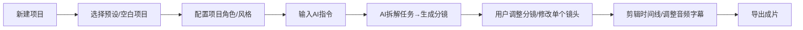

# 产品需求文档（PRD）：VidFlow AI（Flova 复刻版）
**文档版本**：V1.0  
**更新日期**：2026-06-13  
**目标**：复刻 Flova.ai 对话式 AI 视频创作平台，实现「对话驱动+全流程一体化」的 AI 视频创作能力  
**面向用户**：短视频创作者、内容营销团队、个人博主、AI 视频爱好者、无剪辑基础的新手用户

---

## 1. 产品概述
### 1.1 产品定位
VidFlow AI 是**对话式 AI 视频全流程创作平台**，通过自然语言指令驱动 AI 完成「剧本拆解→分镜生成→视频渲染→剪辑导出」全链路工作，同时内置角色/风格一致性控制能力，解决传统视频创作门槛高、效率低、多镜头连贯性差的痛点。

### 1.1.1 生成内核边界

产品中的真正视频生成内核不在前端实现，也不由 Autumn 前端自行编排。

视频生成流程依托后台管理系统中已经接入的“漫剧创作库工业化自动流水线 Agent 体系”。Autumn 前端负责对话式创作入口、参数确认、任务调度、进度展示、素材预览、故事板/时间线回显和结果导出。

前端所有“生成中”“Agent 分析完成”“故事板已更新”“媒体资产生成中”“镜头视频已完成”等状态，都来自后台流水线事件。

### 1.1.2 Agent 数据包边界

Agent 数据包是视频创作流水线的可切换能力包，包含 Agent 编排、Skill、模板、默认参数、提示词片段和流程配置。

产品必须支持两类导入来源：

- 后台导入：从后台管理系统导入，属于账号资源，可跟随账号在多设备同步和切换。
- 本地导入：从当前设备选择本地 JSON / 数据包文件导入，只能在本设备使用，不默认上传后台，不参与账号云同步。

本地导入的数据包必须在 UI 上明确标记“仅本设备可用”，避免用户误以为其他设备或团队成员可以使用。

### 1.1.3 Skill 库边界

Skill 库是项目可启用能力的集合，既可以来自当前 Agent 数据包，也可以从后台 Skill 库导入，或从本地设备导入。

- 数据包内置 Skill：跟随当前 Agent 数据包自动进入项目 Skill 库。
- 后台导入 Skill：从后台管理系统导入，属于账号资源，可跨设备同步。
- 本地导入 Skill：从当前设备导入，仅本设备可用，不默认上传后台，不参与账号云同步。

Skill 库必须支持启用 / 停用。用户发送创作指令时，当前启用 Skill 将作为任务配置传给后台漫剧创作库流水线。

### 1.2 核心价值
1.  **零门槛创作**：无需专业剪辑技能，用自然语言即可生成专业级视频
2.  **全流程一体化**：从创意到成片，一站式完成，无需切换多个工具
3.  **强一致性控制**：解决 AI 视频常见的「人物变脸、人数错乱、风格断层」问题
4.  **高效迭代**：边生成边修改，对话式调整，比传统创作效率提升 10 倍

### 1.3 目标用户
| 用户类型 | 核心需求 |
|----------|----------|
| 个人短视频博主 | 快速生成爆款短视频，无需学习剪辑 |
| 营销内容团队 | 批量生成广告、宣传片，统一品牌视觉 |
| AI 创作爱好者 | 测试 AI 视频能力，实现创意落地 |
| 企业市场人员 | 快速生成产品介绍、活动视频 |

---

## 2. 全局界面布局规范
整体采用**「三栏+底栏」经典创作布局**，深色模式为主，降低长时创作视觉疲劳，布局比例固定为：
- 左侧栏：25% 宽度（资产/故事板管理）
- 中间主画布：45% 宽度（预览/编辑主视图）
- 右侧栏：30% 宽度（AI 对话/参数控制）
- 底部时间线：180px 固定高度（可折叠，视频剪辑轴）

### 2.1 配色规范
- 主背景：深灰 #1A1A2E（页面底色）、#16213E（面板底色）
- 强调色：霓虹蓝 #0F52BA、浅紫 #7B68EE（按钮、进度、高亮）
- 文本色：主文本 #FFFFFF、次要文本 #B0B0B0、提示文本 #707070
- 功能色：成功 #2ECC71、警告 #F39C12、错误 #E74C3C

### 2.2 字体规范
- 全局字体：Inter 无衬线字体
- 标题：16px/粗体
- 正文：14px/常规
- 辅助文本：12px/常规

---

## 3. 详细功能需求
### 3.1 顶部导航栏（全局控制）
| 功能模块 | 详细需求 | 验收标准 |
|----------|----------|----------|
| 品牌区 | 左侧显示产品 Logo+「VidFlow AI」名称 | 点击可返回项目列表页 |
| 功能入口 | 1. 项目列表：查看所有我的项目 2. 模板库：预设视频模板（MV、广告、短视频等） 3. 新建项目：创建新的创作项目 4. 导出：当前项目成片导出 | 入口清晰，hover 有提示 |
| 用户中心 | 1. 头像/登录状态 2. 账单/套餐信息 3. 设置（偏好、快捷键） 4. 帮助中心 | 点击展开下拉菜单 |
| 项目状态 | 显示当前项目名称、保存状态（自动保存中/已保存） | 实时同步，保存失败有提示 |
| Agent 数据包 | 显示当前项目使用的数据包，支持切换、后台导入和本地导入 | 本地包必须标记仅本设备可用 |
| Skill 库 | 显示当前启用 Skill，支持启用/停用、后台导入、本地导入 | 本地 Skill 必须标记仅本设备可用 |

---

### 3.2 左侧栏：资产与故事板管理
左侧栏采用 Tab 切换，默认选中「故事板」，支持拖动调整栏宽。

#### 3.2.1 资产库 Tab
| 功能 | 详细需求 |
|------|----------|
| 素材分类 | 按类型划分： 1. 角色库：用户上传的角色参考图，支持绑定 `--cref`，项目级复用 2. 场景库：用户保存的场景参考图，绑定场景描述 3. 剧本：文本剧本文件 4. 音频：配音、配乐、音效文件 5. 视频：已生成的视频片段 |
| 素材操作 | 1. 上传：支持本地图片/音频/视频上传 2. 预览：hover 缩略图显示大图/播放预览 3. 管理：重命名、删除、收藏、添加到项目 |
| 版本管理 | 每个素材保留历史版本，支持回溯、版本对比 |

#### 3.2.2 故事板 Tab（核心创作区）
| 功能 | 详细需求 |
|------|----------|
| 分镜列表 | 按镜头顺序排列，每个镜头为独立卡片： - 缩略图：镜头预览图 - 标题：镜头 1/镜头 2... - 描述：镜头文字说明 - 时长：镜头时长（如 3.7s） - 状态标签：生成中/已完成/失败 - 进度条：生成进度（0-100%） |
| 镜头操作 | 1. 拖动排序：调整镜头顺序，同步更新时间线 2. 重生成：单独重新生成该镜头，保留其他镜头不变 3. 编辑：手动修改该镜头的提示词、参数 4. 删除：删除该镜头，同步更新时间线 5. 复制：复制该镜头，快速生成同构图不同内容的镜头 |
| 批量操作 | 支持多选镜头，批量重生成、批量删除、批量导出 |

---

### 3.3 中间主画布：预览与编辑区
核心交互区域，支持多视图切换，实时预览当前内容。

| 功能 | 详细需求 |
|------|----------|
| 视图切换 | 1. 单镜头视图（默认）：全屏预览当前选中镜头 2. 分镜对比视图：所有镜头缩略图并排，支持横向滚动 3. 成片预览视图：全屏播放完整成片 |
| 画布工具 | 1. 缩放：支持鼠标滚轮缩放，最小 0.5x，最大 2x 2. 平移：按住鼠标左键拖动平移画布 3. 圈选改图：支持鼠标圈选画布中某一区域，弹出输入框，输入指令修改该区域（如“把这里的背景改成仙境”） 4. 截图：保存当前预览图到资产库 |
| 信息栏 | 底部显示当前镜头信息：分辨率、帧率、时长、使用模型、Seed 值 |
| 播放控制 | 预览时支持播放/暂停、进度条拖动、音量控制 |

---

### 3.4 右侧栏：AI 对话与参数面板
核心指令输入区，Tab 切换「对话助手」和「高级参数」。

#### 3.4.1 AI 对话助手 Tab
| 功能 | 详细需求 |
|------|----------|
| 消息流 | 1. 用户消息：左侧气泡，显示用户输入的指令/上传的图片 2. AI 回复：右侧气泡，显示 AI 拆解的任务、进度、结果反馈 3. 历史记录：保留当前项目的所有对话历史，支持滚动查看 |
| 输入区 | 1. 文本输入框：支持自然语言指令，最大 2000 字 2. 附件上传：支持上传参考图、本地素材 3. 快捷按钮：    - 发送：提交指令    - 重新生成：重新执行上一条指令    - 清空对话：清空当前项目的对话历史 |
| 指令解析 | AI 自动解析用户指令： 1. 拆解多镜头任务：如“生成 5 镜女团 MV”自动拆成 5 个分镜 2. 提取约束规则：如“严禁出现 5 个人”自动提取为生成约束，附加到所有镜头 3. 识别参考图：自动将上传的图转为垫图/角色参考/风格参考 |

#### 3.4.2 高级参数 Tab
| 功能 | 详细需求 |
|------|----------|
| 模型选择 | 下拉选择 AI 生成模型：Seedance 2.0、Kling、Sora 2、GPT Image 2.0 等 |
| 基础参数 | 1. 分辨率：1080P/4K/自定义 2. 帧率：24/30/60fps 3. 风格预设：电影质感、写实、动漫、国风等 |
| 一致性参数 | 1. 角色参考（--cref）：选择资产库中的角色图，支持多角色绑定，调整角色权重 `--cw`（0-100） 2. 风格参考（--sref）：选择风格参考图，调整风格权重 `--sw`（0-1000） 3. 垫图权重（--iw）：调整垫图的参考权重（0.5-3） 4. 随机种子（--seed）：输入 Seed 值，固定构图 |
| 项目级预设 | 支持将当前参数保存为项目默认参数，所有新镜头自动继承 |

---

### 3.5 底部时间线：视频剪辑轴
全项目剪辑控制区，可折叠，支持缩放时间轴。

| 功能 | 详细需求 |
|------|----------|
| 轨道结构 | 1. 视频轨道：分镜片段按顺序排列，支持拖动调整位置、拉伸调整时长 2. 音频轨道：配音、配乐、音效，支持音量调整、淡入淡出 3. 字幕轨道：自动生成的字幕，支持手动编辑、调整位置 |
| 剪辑功能 | 1. 切割：将片段切割为两个独立片段 2. 拼接：合并相邻片段 3. 转场：支持淡入淡出、滑动、闪切等转场效果 4. 删除：删除选中片段 |
| 播放控制 | 1. 播放/暂停、快进/快退 2. 时间轴缩放：滚轮缩放时间轴，最小 1s/格，最大 10s/格 3. 全局时长显示：显示项目总时长 |
| 联动同步 | 1. 时间线选中片段，自动同步选中左侧故事板对应镜头、中间预览对应内容 2. 故事板调整顺序，自动同步更新时间线片段顺序 |

---

## 4. 核心业务流程
### 4.1 标准创作流程

### 4.2 核心交互逻辑
1.  **对话驱动创作**
    - 用户输入自然语言指令，AI 自动拆解为分镜任务，逐个生成镜头
    - 生成过程中，用户可随时发送新指令调整，无需等待全部生成完成
2.  **全模块实时联动**
    - 任何模块的修改（故事板排序、时间线调整、对话改图），实时同步到其他所有模块
    - 比如用户在对话里修改“把背景改成泳池”，对应镜头的故事板缩略图、中间预览、时间线片段同步更新
3.  **一致性保障机制**
    - 项目级角色预设：创建项目时绑定 4 个女团角色，所有镜头自动携带 `--cref`，保证人数固定、人物不变
    - 约束规则继承：用户输入的“严禁出现 5 个人”等约束，自动附加到所有镜头的生成参数中
    - 风格统一：项目级 `--sref` 预设，所有镜头自动继承统一画风

---

## 5. 项目管理功能
### 5.1 项目基础功能
- 新建项目：支持输入项目名称、选择分辨率、帧率
- 自动保存：每 30 秒自动保存项目状态，支持手动保存
- 版本回溯：保留项目的所有历史版本，支持回滚到任意版本
- 云同步：项目自动同步到云端，多设备登录可访问

### 5.2 导出功能
- 导出格式：支持 MP4、GIF、MOV
- 分辨率：支持 720P、1080P、4K
- 帧率：支持 24/30/60fps
- 选项：支持选择是否导出字幕、是否压缩画质
- 导出进度：显示导出进度，完成后支持下载到本地

### 5.3 Agent 数据包管理

| 功能 | 详细需求 |
| --- | --- |
| 数据包切换 | 项目内可切换当前使用的 Agent 数据包，切换后影响后续对话、Skill 匹配、任务拆解和流水线配置 |
| 后台导入 | 从后台管理系统导入账号级 Agent 数据包，支持多设备同步、团队共享和版本更新 |
| 本地导入 | 从当前设备导入本地 Agent 数据包，仅本设备可用；不上传后台、不自动同步、不影响账号资源 |
| 来源标识 | 数据包列表必须显示来源：后台导入 / 本地导入 |
| 作用域标识 | 后台包显示“账号”，本地包显示“本设备” |
| 安全限制 | 本地包中的脚本、模板和配置只能作为前端可读配置进入工作台，不允许绕过后台鉴权直接调用模型内核 |
| 版本管理 | 显示数据包版本、更新时间；后台包支持检查更新，本地包支持重新导入覆盖 |

### 5.4 Skill 库管理

| 功能 | 详细需求 |
| --- | --- |
| Skill 列表 | 展示当前项目可用 Skill，包含数据包内置、后台导入、本地导入三类 |
| 启用 / 停用 | 用户可启用或停用单个 Skill，影响后续 Pipeline 任务配置 |
| 后台导入 | 从后台 Skill 库导入账号级 Skill，可多设备同步 |
| 本地导入 | 从当前设备导入本地 Skill，仅当前设备可用，不上传后台、不自动同步 |
| 来源标识 | Skill 卡片必须显示数据包内置 / 后台导入 / 本地导入 |
| 作用域标识 | 后台 Skill 显示“账号”，本地 Skill 显示“本设备” |
| 安全限制 | 本地 Skill 只能作为配置和提示词能力启用，不允许直接调用底层生成模型 |

---

## 6. 错误处理与用户提示
针对用户之前遇到的生成失败问题，优化错误提示：
1.  **任务失败提示**：
    - 原错误码 `Lingdong video task failed` 转为友好提示：「视频生成任务失败，请检查参考图链接是否可访问，或调整生成参数后重试」
    - 失败镜头卡片显示「重试」按钮，点击可重新生成
2.  **参数错误提示**：
    - 输入非法参数时，实时提示：「Seed 值需为 0-4294967295 的整数」
3.  **素材加载失败**：
    - 参考图无法访问时，提示：「参考图链接无法加载，请更换可公开访问的图片链接」

---

## 7. 非功能需求
### 7.1 性能需求
- 页面加载时间：<2s
- 指令响应时间：<1s
- 生成速度：Turbo 模式 10-20s/镜头，Fast 模式 30-60s/镜头
- 预览加载时间：<500ms
- 系统可用性：99.9%

### 7.2 兼容性
- 浏览器：支持 Chrome 110+、Edge 110+、Firefox 109+
- 系统：支持 Windows 10+、MacOS 12+
- 屏幕：适配 1920*1080 及以上分辨率

### 7.3 安全性
- 用户数据加密存储，素材仅用户本人可访问
- 接口鉴权，防止未授权访问
- 隐私保护：用户上传的素材不会用于训练

---

## 8. 迭代计划
### 8.1 MVP 阶段（1 个月）
- 完成基础三栏+底栏界面布局
- 实现核心对话生成、单镜头生成功能
- 完成基础剪辑时间线功能
- 支持基础导出功能
- 实现项目保存、云同步

### 8.2 成长阶段（2 个月）
- 新增角色/风格一致性控制（--cref/--sref）
- 新增批量生成分镜功能
- 新增模板库、角色库、场景库
- 新增自动字幕、配音功能
- 优化错误提示与用户引导

### 8.3 成熟阶段（3 个月）
- 新增团队协作功能，支持多人编辑
- 新增 API 接口，支持第三方集成
- 新增更多 AI 模型支持
- 新增高级剪辑功能（调色、特效）
- 新增移动端适配

---

## 9. 风险与应对
| 风险 | 应对方案 |
|------|----------|
| AI 生成仍出现人数错乱 | 1. 项目级角色绑定，强制 4 个角色输入到生成参数 2. 指令中自动附加「固定 4 人，严禁第五人」的约束 |
| 生成速度慢 | 1. 提供 Turbo/Fast 两种模式，用户可选择 2. 边生成边预览，用户可提前调整 |
| 一致性不足 | 1. 优化 `--cref`/`--sref` 参数的传递逻辑 2. 提供项目级参数继承，所有镜头统一参数 |

---

这份 PRD 完整覆盖了 Flova 的核心能力，同时针对性解决了你之前遇到的「人物错乱、生成失败」等问题，开发团队可以直接基于这份文档进行设计和开发。如果需要补充某个模块的细节，或者调整功能优先级，可以随时告诉我。
