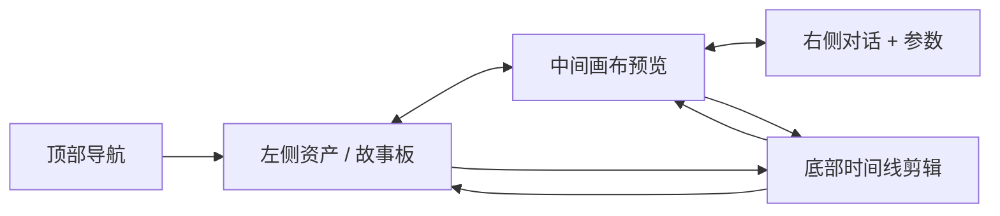

# Flova.ai 界面交互与布局文档

文档版本：V1.0  
更新日期：2026-06-13  
适用项目：Autumn 前端工程  
定位：对话式 AI 视频创作平台的界面布局、区域职责、交互逻辑和核心组件关系说明。

## 1. 产品界面定位

Flova.ai 是对话式 AI 视频创作平台，核心是“左中右三栏 + 底部时间线”的创作布局，把“素材 / 故事板 - 预览 - 对话指令 - 时间线”强绑定，形成对话驱动创作的工作方式。

Autumn 项目需要参考该交互模型，建设 VidFlow AI / Flova 复刻版创作工作台。

## 2. 整体布局

### 2.1 页面结构

页面从上到下、从左到右包含：

- 顶部导航栏：全局功能入口。
- 左侧栏：资产库、故事板、分镜库。
- 中间主画布：预览与编辑主视图。
- 右侧栏：AI 对话助手与参数面板。
- 底部时间线：视频剪辑轴与轨道控制。

```text
┌──────────────────────────────────────────────────────────────┐
│ Top Bar                                                      │
├───────────────┬──────────────────────────┬───────────────────┤
│ Left Panel    │ Center Canvas            │ Right Panel       │
│ Assets /      │ Preview / Edit           │ Chat / Params     │
│ Storyboard    │                          │                   │
├───────────────┴──────────────────────────┴───────────────────┤
│ Bottom Timeline                                               │
└──────────────────────────────────────────────────────────────┘
```

### 2.2 布局比例

- 左侧栏：25%。
- 中间主画布：45%。
- 右侧栏：30%。
- 底部时间线：150-200px，默认建议 180px，可折叠。
- 顶部导航栏：建议 56px。

### 2.3 视觉风格

- UI 必须支持夜间模式和白天模式两套主题。
- 夜间模式使用深色背景，降低长时间创作的视觉疲劳。
- 白天模式使用白色、浅灰、柔和蓝绿背景，适合明亮办公环境。
- 关键操作和选中态使用霓虹蓝、浅紫、青绿强调色。
- 功能状态使用成功、警告、错误等明确颜色区分。

### 2.4 双主题资源

- 夜间模式参考图：`src/assets/ui-mockups/20260613-editor-workspace-reference-v02-4k.png`
- 白天模式参考图：`src/assets/ui-mockups/20260613-editor-workspace-reference-v03-light-4k.png`

### 2.5 主页 / 项目列表资源

主页是用户进入 Autumn 后的项目工作台入口，负责展示项目列表、创建新项目、快捷生成、元素库、Skill 和教程等一级导航。

- 夜间模式参考图：`src/assets/ui-mockups/20260613-home-projects-dark-4k.png`
- 白天模式参考图：`src/assets/ui-mockups/20260613-home-projects-light-4k.png`

主页核心结构：

- 左侧主导航：主页、项目、快速生成、元素库、Skill、Autumn TV、教程、设置。
- 顶部栏：产品 Logo、当前模块名称、活动入口、积分 / 套餐 / 用户区。
- 项目网格：创建新项目卡片、最近编辑项目卡片、占位项目卡片。
- 快捷浮动入口：模板 / 扩展能力 / 语言相关工具。

### 2.6 新建项目空白状态

点击“创建新项目”后进入编辑器默认空态。该状态需要让用户直接感知“从右侧对话开始创作”。

- 默认空态参考图：`src/assets/ui-mockups/20260613-empty-project-default-dark-4k.png`
- 默认空态白天模式参考图：`src/assets/ui-mockups/20260614-empty-project-default-light-4k.png`
- 故事板 / 媒体文件 / 时间线 / 文档四状态对照板：`src/assets/ui-mockups/20260613-empty-project-panel-states-dark-4k.png`
- 故事板 / 媒体文件 / 时间线 / 文档四状态白天模式对照板：`src/assets/ui-mockups/20260614-empty-project-panel-states-light-4k.png`
- 故事板 + 媒体文件双开参考图：`src/assets/ui-mockups/20260613-empty-project-storyboard-media-dark-4k.png`
- 故事板 + 媒体文件双开白天模式参考图：`src/assets/ui-mockups/20260614-empty-project-storyboard-media-light-4k.png`
- 状态清单：`agents/runs/run-001-docs-to-mvp-kickoff/empty-project-interaction-states.md`

新建项目状态必须满足：

- 顶部项目名默认为“无标题”。
- 右侧对话面板始终存在，空态显示“暂无消息”。
- 默认主区域显示 Create / 开始引导。
- 故事板、媒体文件、时间线、文档入口由顶部按钮控制。
- 故事板和媒体文件允许同时打开，形成左故事板 + 中间预览 / 媒体 + 右对话布局。

### 2.7 录屏补充状态资源

根据用户提供的 Flova 录屏与 13 张截图，Autumn 需要额外覆盖对话驱动创作过程中的完整状态。

- 状态图谱文档：`docs/flova-video-creation-state-map.md`
- 抽帧分析记录：`agents/runs/run-001-docs-to-mvp-kickoff/flova-video-frame-analysis.md`
- 对话流状态板暗色：`src/assets/ui-mockups/20260614-chat-flow-states-dark-4k.png`
- 对话流状态板白天：`src/assets/ui-mockups/20260614-chat-flow-states-light-4k.png`
- 生产工作台状态板暗色：`src/assets/ui-mockups/20260614-production-workspace-states-dark-4k.png`
- 生产工作台状态板白天：`src/assets/ui-mockups/20260614-production-workspace-states-light-4k.png`
- 媒体生成 / 视频状态板暗色：`src/assets/ui-mockups/20260614-media-generation-video-states-dark-4k.png`
- 媒体生成 / 视频状态板白天：`src/assets/ui-mockups/20260614-media-generation-video-states-light-4k.png`

## 3. 顶部导航栏

### 3.1 区域职责

顶部导航栏负责全局控制和项目级状态展示。

### 3.2 内容结构

- Logo + 产品名：Flova.ai / VidFlow AI。
- 首页入口。
- 项目列表入口。
- 模板库入口。
- 新建项目按钮。
- 导出 / 发布按钮。
- 设置 / 帮助入口。
- 用户头像、登录 / 注册、账单入口。
- 当前项目名称。
- 自动保存状态。

### 3.3 交互要求

- 点击 Logo 返回项目列表。
- 新建项目弹出创建项目弹窗。
- 导出按钮打开导出配置弹窗。
- 用户头像点击展开用户菜单。
- 保存状态需要实时显示：自动保存中、已保存、保存失败。
- 关键按钮 hover 时需要有清晰反馈。

## 4. 左侧栏：资产 + 故事板

左侧栏是创作核心库，包含“资产库”和“故事板”两个 Tab。

### 4.1 资产库 Tab

#### 4.1.1 素材分类

- 剧本。
- 分镜图。
- 角色库。
- 场景库。
- 音频。
- 视频片段。

#### 4.1.2 资产卡片信息

- 缩略图。
- 素材名称。
- 素材类型。
- 收藏状态。
- 版本号。
- 更新时间。

#### 4.1.3 操作能力

- 上传素材。
- 删除素材。
- 重命名素材。
- 收藏素材。
- 添加到项目。
- 版本回溯。
- 版本对比。

#### 4.1.4 预览交互

- 小缩略图网格展示。
- hover 时显示大图或视频预览。
- 点击打开素材详情。
- 角色图可绑定 `--cref`。
- 风格图可绑定 `--sref`。
- 垫图可绑定 `--iw`。

### 4.2 故事板 Tab

#### 4.2.1 分镜列表

故事板按镜头顺序排列：

- 镜头 1。
- 镜头 2。
- 镜头 3。
- 后续镜头按顺序递增。

#### 4.2.2 镜头卡片信息

- 缩略图。
- 镜头标题。
- 镜头描述。
- 时长。
- 状态：生成中、已完成、失败。
- 生成进度条。
- 模型标签，例如 GPT Image 2.0、Seedance 2.0、Sora 2、Kling。

#### 4.2.3 镜头操作

- Regenerate：重生成单个镜头。
- Manual Edit：手动修改提示词和参数。
- 拖动排序：调整镜头顺序。
- 删除镜头。
- 复制镜头。
- 批量选择。
- 批量重生成。
- 批量删除。
- 批量导出。

#### 4.2.4 联动逻辑

- 选中镜头后，中间画布显示该镜头。
- 选中镜头后，右侧参数面板加载该镜头参数。
- 拖动排序后，底部时间线同步调整片段顺序。
- 删除镜头后，时间线对应片段同步删除。
- 重生成镜头时，卡片显示生成中状态和进度。

## 5. 中间主画布：预览 + 编辑区

中间主画布是当前内容的主编辑区域。

### 5.1 核心预览

- 默认展示当前选中镜头。
- 可展示图片预览。
- 可展示视频预览。
- 可展示成片预览。
- 预览区域应最大化利用可用空间。

### 5.2 视图切换

- 单镜头视图：默认视图，显示当前选中镜头。
- 分镜对比视图：多镜头并排，用于比较分镜一致性。
- 视频播放视图：完整成片预览。

### 5.3 画布工具

- Zoom In。
- Zoom Out。
- Pan。
- 截图。
- 对比。
- 圈选区域。
- 在图上添加文字评论。
- 将圈选区域和文字指令提交给 AI 修改。

### 5.4 圈选改图交互

推荐流程：

```text
用户圈选画布区域
  -> 弹出局部修改输入框
  -> 输入修改指令
  -> 前端生成选区坐标和 mask 信息
  -> 提交给 AI 修改任务
  -> 任务进度同步到故事板和对话区
  -> 生成结果刷新画布和资产库
```

### 5.5 信息栏

底部信息栏展示：

- 镜头描述。
- 分辨率。
- 帧率。
- 时长。
- 模型信息。
- Seed 值。
- 生成状态。

## 6. 右侧栏：AI 对话助手 + 参数面板

右侧栏是核心指令区，包含“对话助手”和“高级参数”两个 Tab。

### 6.1 对话区

#### 6.1.1 消息流

消息类型：

- 用户消息：自然语言指令，例如“把背景改成仙境”。
- AI 回复：拆解任务、给出选项、进度通知、结果反馈。
- 系统消息：生成失败、保存成功、导出完成、网络断开。
- 附件消息：参考图、素材、提示词文件。

#### 6.1.2 输入框

输入框固定在右侧栏底部。

能力：

- 输入自然语言指令。
- 粘贴提示词。
- 上传图片作为参考图。
- 上传本地素材。
- 最大 2000 字。

#### 6.1.3 快捷按钮

- Send：发送指令。
- Regenerate：重新生成上一条指令。
- Clear：清空对话。
- History：查看历史记录。
- Attach：添加附件。

### 6.2 参数面板

参数面板可折叠或以 Tab 形式展示。

#### 6.2.1 模型选择

支持模型：

- GPT Image 2.0。
- Seedance 2.0。
- Sora 2。
- Kling。
- 后续后台模型配置系统返回的可用模型。

#### 6.2.2 风格参数

- 画风。
- 色调。
- 质感。
- 分辨率。
- 帧率。
- 视频时长。

#### 6.2.3 高级参数

- `--iw`：垫图权重。
- `--seed`：随机种子。
- `--cref`：角色参考。
- `--sref`：风格参考。
- `--cw`：角色权重。
- `--sw`：风格权重。

#### 6.2.4 参数继承

- 项目级参数作为默认值。
- 新镜头默认继承项目级参数。
- 单个镜头可覆盖项目级参数。
- 用户在对话中提出的约束可自动写入项目级生成约束。

## 7. 底部时间线：视频剪辑轴

底部时间线负责视频剪辑和轨道控制。

### 7.1 轨道结构

- 视频轨道：分镜片段按顺序排列。
- 音频轨道：配音、配乐、音效。
- 字幕轨道：自动生成字幕或手动字幕。

### 7.2 控制功能

- 播放。
- 暂停。
- 快进。
- 快退。
- 切割片段。
- 拼接片段。
- 删除片段。
- 调整片段时长。
- 添加转场效果。
- 时间轴放大。
- 时间轴缩小。
- 折叠 / 展开时间线。

### 7.3 同步逻辑

- 时间线选中片段，左侧故事板同步选中对应镜头。
- 时间线选中片段，中间画布同步显示对应内容。
- 故事板调整顺序，时间线视频轨同步调整顺序。
- 对话生成新镜头，故事板和时间线同步插入占位。
- 生成完成后，时间线占位片段替换为真实视频片段。

## 8. 核心交互逻辑

### 8.1 对话驱动创作

用户不需要手动拖素材，而是通过自然语言发出指令，AI 自动完成任务拆解、生成和排布。

示例：

```text
生成一个仙境场景，有浮空山、瀑布、发光植物，电影质感
```

AI 处理流程：

```text
理解指令
  -> 拆解镜头
  -> 选择模型
  -> 创建生成任务
  -> 生成镜头
  -> 放入故事板
  -> 同步到底部时间线
```

### 8.2 双线并行

右侧对话区用于发新指令和修改需求。

左侧故事板、中间画布、底部时间线用于手动精修已生成镜头。

用户不需要等待整片生成完成后再修改，可以边生成边调整。

### 8.3 一致性控制

关键一致性参数：

- 角色一致：通过 `--cref` 锁定脸、身材和角色身份。
- 风格一致：通过 `--sref` 锁定画风和色调。
- 构图一致：通过 `--seed` 锁定布局和光影。
- 垫图一致：通过 `--iw` 控制参考图影响强度。

### 8.4 实时联动

任意模块发生变化，都需要通过统一状态更新其他模块。



## 9. 与 MJ / Stable Diffusion 界面差异

### 9.1 MJ

- 偏纯对话。
- 主要展示网格图。
- 缺少故事板。
- 缺少视频时间线。
- 更适合单图生成。

### 9.2 Stable Diffusion

- 偏参数表单。
- 插件能力强。
- 专业门槛较高。
- 缺少对话式视频全流程编排。

### 9.3 Flova / Autumn

- 对话 + 故事板 + 时间线强绑定。
- 面向视频全流程。
- 支持多镜头连贯创作。
- 支持角色、风格和构图一致性控制。
- 支持边生成边编辑。

## 10. 核心组件清单

### 10.1 Layout Components

- `EditorShell`
- `TopBar`
- `LeftPanel`
- `CenterCanvas`
- `RightPanel`
- `BottomTimeline`
- `ResizablePanel`
- `PanelHeader`

### 10.2 Business Components

- `AssetLibrary`
- `AssetGrid`
- `AssetCard`
- `StoryboardPanel`
- `StoryboardList`
- `StoryboardCard`
- `CanvasEditor`
- `CanvasToolbar`
- `VideoPreview`
- `ShotCompareView`
- `ChatPanel`
- `ChatMessageList`
- `ChatComposer`
- `ParamPanel`
- `ModelSelector`
- `GenerationParamForm`
- `TimelineEditor`
- `TimelineTrack`
- `TimelineClip`

### 10.3 Common Components

- `AppButton`
- `IconButton`
- `SegmentedTabs`
- `StatusBadge`
- `ProgressBar`
- `EmptyState`
- `ErrorNotice`
- `ConfirmDialog`
- `UploadDropzone`
- `Tooltip`

## 11. 开发落地要求

- 页面首屏必须是可用的创作工作台，不做营销式落地页。
- 各区域职责清晰，不互相侵入。
- 所有联动必须通过 store 或 service 统一处理。
- 交互状态必须覆盖 loading、empty、error、disabled、success。
- 所有参数输入必须有范围校验和错误提示。
- 时间线、画布、对话、故事板必须能互相同步选中状态。
- 后续开发以该文档作为 UI 与交互基线。
