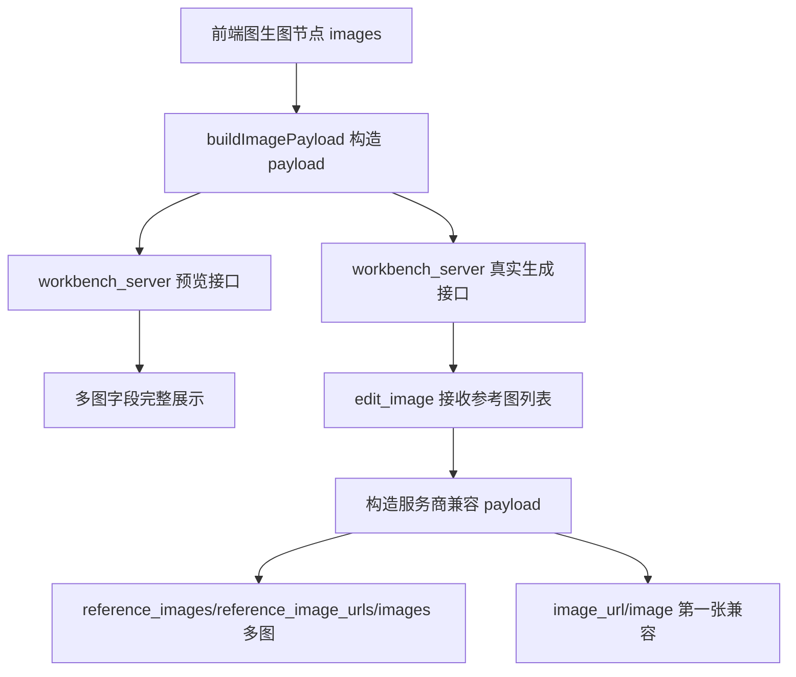

## User Requirements

修复生图工作台图生图多参考图参数构造问题。用户上传三张不同参考图时，最终请求参数不应把所有参考图字段都压成同一个 URL。

## Product Overview

本次修改聚焦图生图请求链路中的多参考图保真传递，让前端上传的多张参考图在调试预览和真实生成请求中都完整保留，同时继续兼容不同图像服务商使用的字段格式。

## Core Features

- 解释并保留 `reference_images`、`reference_image_urls`、`images` 等多种兼容字段。
- 修复多张参考图被后端压缩成第一张图的问题。
- 图生图 JSON 预览接口应展示完整多参考图列表。
- 真实图生图生成接口应向后端编辑函数传递完整参考图列表。
- `image_url` / `image` 可继续保留第一张作为单图兼容字段。
- `VIP` 模式继续使用公网 URL，`Fast` 模式继续使用本地 base64 dataUrl。
- 不影响文生图、全景图、单参考图、历史记录和生成结果保存链路。

## Tech Stack Selection

- 前端：沿用现有原生 HTML、CSS、JavaScript 工作台。
- 后端：沿用现有 Python HTTP 服务与图像生成适配层。
- 主要修改文件：
- `/Users/billy/Documents/AI_pro/漫剧创作库/tools/workbench_server.py`
- `/Users/billy/Documents/AI_pro/漫剧创作库/tools/image_studio_backend.py`
- `/Users/billy/Documents/AI_pro/漫剧创作库/tools/workbench-web/image-studio-canvas.html`

## Implementation Approach

采用“多图主字段完整保留 + 单图字段向后兼容”的修复策略。当前代码中 `run_image_provider_payload_preview()` 已经能收集多张参考图，但随后用 `reference_images[0]` 构造所有字段；`run_image_generation()` 也只把第一张图传给 `edit_image()`；`edit_image()` 函数签名本身只支持单图。修复时应把参考图列表作为一等数据结构贯穿预览、真实生成和服务商 payload 构造。

关键决策：

- `reference_images`、`reference_image_urls`、`images` 作为多图主字段，必须包含全部有效参考图。
- `image_url`、`image` 作为旧接口兼容字段，只保留第一张参考图。
- 保留 `_build_reference_payload()` 和 `_collect_reference_payloads()` 的现有校验模式，避免重复实现协议校验。
- `edit_image()` 支持 `str` 和 `list[str]` 输入，降低对既有调用点的破坏。
- `panorama` 分支已经接收多图列表，不应改动其生成语义。
- 前端当前 `buildImagePayload()` 中 `VIP` 最多保留 8 张，但 `Fast` 只保留 1 张；本次应评估是否将图生图 Fast 也改为多图传递，若上游请求体限制较高则允许多张，否则至少在预览文案中明确限制原因。

## Implementation Notes

- `workbench_server.py` 的 `run_image_provider_payload_preview()` 中不能再使用单个 `reference_value` 填充所有字段。
- `run_image_generation()` 中图生图分支应调用 `edit_image(payload, reference_images, temp_output_dir)`，并将 `uploadedCount` 设置为 `len(reference_images)`。
- `image_studio_backend.py` 中 `edit_image()` 应统一归一化参考图输入为 `list[str]`，再通过 `_collect_reference_payloads()` 构造对象数组。
- 请求 payload 中继续带上 `quality`、`background`、`output_format`、`strength`、`lora_weight`、`seam_fix` 等原有参数。
- 不记录 API Key、base64 全量内容或超长图片数据到日志，避免泄露和日志膨胀。
- 对 Fast base64 多图需要注意请求体大小；如保留单图限制，应在前端或调试预览中明确说明。
- 修改范围只限图生图多参考图 payload，不混入 Fast/VIP 上传 UI 行为修复。

## Architecture Design

现有链路保持不变，仅修正参考图列表在链路中的传递方式：



## Directory Structure

```text
/Users/billy/Documents/AI_pro/漫剧创作库/
└── tools/
    ├── workbench_server.py
    │   # [MODIFY] 修复图生图 payload 预览与真实生成分支：
    │   # run_image_provider_payload_preview 保留完整多图字段；
    │   # run_image_generation 向 edit_image 传完整 reference_images；
    │   # uploadedCount 使用真实参考图数量。
    ├── image_studio_backend.py
    │   # [MODIFY] 扩展 edit_image 支持单图/多图输入；
    │   # 使用 _collect_reference_payloads 生成 reference_images 对象数组；
    │   # 保留 image_url/image 单图兼容字段。
    └── workbench-web/
        └── image-studio-canvas.html
            # [MODIFY] 复核并必要时调整 buildImagePayload/runGenerate：
            # 确保前端传给后端的图生图参考图列表没有提前丢失；
            # 更新调试预览说明，区分多图主字段与单图兼容字段。
```

## Key Code Structures

```python
def edit_image(
    payload: dict[str, Any],
    reference_images: str | list[str],
    output_dir: Path
) -> dict[str, Any]:
    ...
```

核心 payload 结构应满足：

```python
{
    "reference_images": [{"image_url": url} for url in reference_values],
    "reference_image_urls": reference_values,
    "images": reference_values,
    "image_url": first_reference,
    "image": first_reference,
}
```

## Agent Extensions

### SubAgent

- **code-explorer**
- Purpose: 复核图生图从前端 `buildImagePayload()` 到后端 `run_image_generation()`、`edit_image()` 的真实调用链。
- Expected outcome: 确认三张参考图在哪一层被截断，并限定最小修改范围。

### Skill

- **playwright-cli**
- Purpose: 修改后在工作台中验证三图 VIP/Fast 的调试预览和生成请求表现。
- Expected outcome: 确认多图字段显示完整，单图兼容字段只取第一张，相关链路无回归。