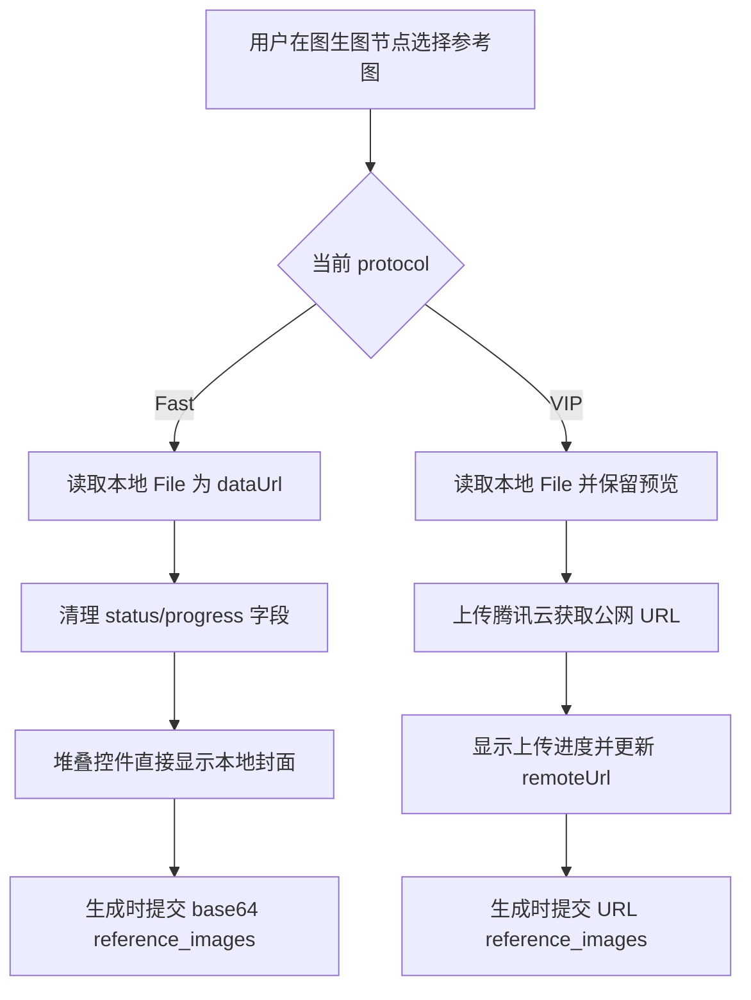

## User Requirements

- 修复生图工作台图生图节点在 `Fast` 模式下的参考图导入行为：选择本地图片后只做本地预览，不执行上传腾讯云逻辑，不显示上传进度、读取进度、百分比遮罩或完成闪烁反馈。
- 保持 `VIP` 模式的现有云端上传能力：选择本地图片后允许显示上传进度，并继续获取公网 URL。
- 修复图生图参考图堆叠控件的封面显示问题：无论 `Fast` 还是 `VIP`，导入参考图后堆叠封面都应完整展示图片内容，不能被方形缩略图样式或卡片裁切规则截断。
- 修改范围应聚焦在图生图参考图导入与堆叠封面显示，不影响单图节点、全景图节点、视频参考图、历史记录和生成结果预览链路。

## Product Overview

本次修改是对生图工作台图生图参考图交互的局部修复，重点让 `Fast` 模式更轻量、直接，并让参考图堆叠控件的视觉预览更准确。

## Core Features

- `Fast` 模式本地参考图即时预览。
- `Fast` 模式禁止触发腾讯云上传与上传进度 UI。
- `VIP` 模式继续支持云端上传和进度反馈。
- 参考图堆叠控件封面完整显示。
- 保持现有生成 payload 中 `Fast=base64`、`VIP=公网 URL` 的模式分流。

## Tech Stack Selection

- 前端：沿用现有原生 HTML、CSS、JavaScript 单页工作台。
- 后端：本次不新增后端能力，仅在验证阶段通过日志确认 `/upload-reference` 是否被触发。
- 主要修改文件：`/Users/billy/Documents/AI_pro/漫剧创作库/tools/workbench-web/image-studio-canvas.html`。
- 辅助验证文件：`/Users/billy/Documents/AI_pro/漫剧创作库/tools/workbench-web/workbench-engine.js`、`/Users/billy/Documents/AI_pro/漫剧创作库/tools/workbench_server.py` 的现有链路不做结构性调整。

## Implementation Approach

采用“小范围行为分流 + CSS 定向覆盖”的方式修复。
在 `readFilesToNode(id, files)` 中增加 `isFastI2I = n.type === 'img2imgAll' && protocol === 'fast'` 分支，让 Fast 图生图导入只读取本地 `dataUrl` 并立即渲染，不设置 `status/progress/progressLabel`，不调用 `ensureReferenceImageUploaded`，不触发上传遮罩和完成闪烁。VIP 分支保留现有上传与进度逻辑。

堆叠封面问题通过 CSS 定向修复：为 `.vn2-ref-stack > .thumb` 增加专用样式，覆盖全局 `.thumb` 的 48×48 方形裁切规则；让堆叠封面外层成为 39×51 卡片本体，内部图片使用 `object-fit: contain` 和居中显示，从而保证完整展示参考图。

## Implementation Notes

- `readFilesToNode` 需要保留 `singleImage`、`imageToPanorama`、`panoramaViewer` 等已有逻辑，不把 Fast 图生图规则扩散到其它节点。
- Fast 图生图导入时不应出现：
- `上传腾讯云对象存储`
- `等待公网 URL`
- 百分比遮罩
- `done-flash`
- 上传/导入进度 toast
- VIP 图生图导入时仍应出现上传进度，并继续调用 `ensureReferenceImageUploaded`。
- CSS 覆盖必须只作用于 `.vn2-ref-stack > .thumb`，避免影响参考图展开列表 `.vn2-ref-chip`、历史缩略图、普通上传缩略图。
- 使用 `object-fit: contain` 优先保证完整显示；如果后续用户希望铺满卡片，可再切换为 `cover`。
- 验证时优先通过浏览器手测和服务日志判断：Fast 不应出现 `/upload-reference`，VIP 应出现 `/upload-reference`。

## Architecture Design

本次为局部前端修复，不改变现有架构。相关数据流保持为：



## Directory Structure

```text
/Users/billy/Documents/AI_pro/漫剧创作库/
└── tools/
    └── workbench-web/
        └── image-studio-canvas.html
            # [MODIFY] 修复图生图 Fast 模式参考图导入行为：
            # Fast 只读取本地 dataUrl，不设置上传/进度状态，不触发腾讯云上传；
            # VIP 保持现有上传进度逻辑。
            # 同时新增 .vn2-ref-stack > .thumb 专用 CSS，
            # 避免堆叠封面被全局 .thumb 方形缩略图样式裁切。
```

## Validation Strategy

- Fast 手测：
- 进入图生图节点，选择 `Fast`。
- 上传本地参考图。
- 预期：封面立即出现，无百分比、无上传遮罩、无腾讯云上传提示。
- 查看 `.codebuddy/logs/studio-server.log`，不应出现 `/upload-reference`。
- VIP 手测：
- 切换到 `VIP`。
- 上传本地参考图或对已有 Fast 图补上传。
- 预期：出现上传进度，日志出现 `/upload-reference`。
- 视觉验证：
- Fast 和 VIP 下堆叠控件封面均完整显示图片，不再被红框区域内的卡片裁切。
- 回归验证：
- 单图节点上传仍正常。
- 图生图生成仍能按 `Fast=base64`、`VIP=URL` 构造请求。

## Agent Extensions

### SubAgent

- **code-explorer**
- Purpose: 复核 `image-studio-canvas.html` 中 `readFilesToNode`、`renderI2iImageThumb`、`.vn2-ref-stack`、`.thumb` 的真实调用链和样式覆盖关系。
- Expected outcome: 确认修改只影响图生图参考图导入与堆叠封面，不误伤其它图片/视频节点。

### Skill

- **playwright-cli**
- Purpose: 在修改后辅助验证工作台页面中的 Fast/VIP 参考图导入、堆叠封面显示和上传日志行为。
- Expected outcome: 得到可复现的手测/自动化检查结果，确认 Fast 不上传、VIP 上传、封面完整显示。