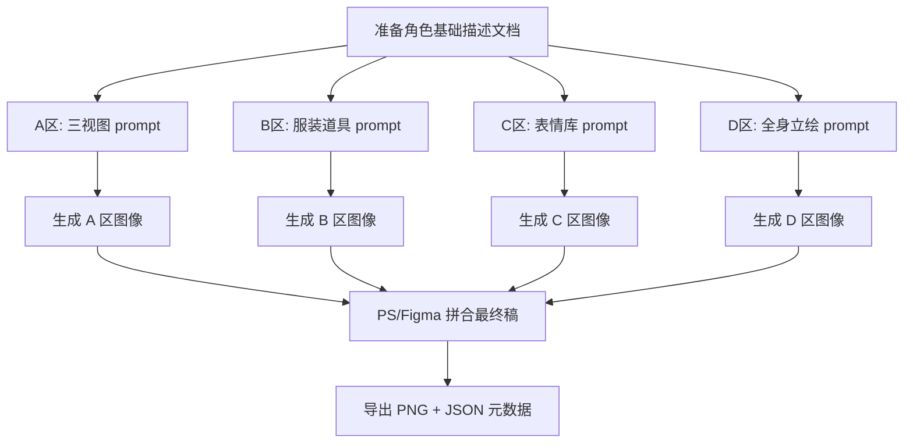

# 角色设定稿（三视图）提示词输出规范

## 一、概述

### 1.1 定义
角色设定稿（Character Design Sheet）是一张包含角色多视角、服装道具、表情变化的综合参考图，用于统一角色视觉标准，供建模、动画、分镜、资产制作等下游环节参考。

### 1.2 适用场景
- 漫剧角色首次定妆
- 游戏角色概念设计
- 动画/影视角色美术参考
- AI 生图的角色一致性基准图

### 1.3 输出目标模型
**统一使用 `gpt-image-2`**，最大支持 4096×4096。建议使用 **4096×2304（16:9 宽屏）** 或 **2048×2048（1:1）**。

### 1.4 硬性背景规则
- **所有角色资产必须使用纯白 / 干净浅色背景**，不加复杂场景、不加氛围背景、不用战斗现场背景
- 只允许极轻微地面接触阴影
- 角色、服装、道具细节必须清晰可拆解
- 版面采用细黑线分栏、多宫格排版，参考专业角色设定稿排版体系

### 1.5 道具独立出图范围规则
- 只为**重要的、独立承担叙事 / 动作 / 世界观功能**的道具产出单独多视角道具设定稿
- 如果道具已经作为角色随身武器、随身物品、头饰、配饰、鞋履、服装组件等在角色卡 / 角色设定稿的多视图与服装道具平铺区中**清晰展示**，则不再单独产出道具图
- 除非该道具后续独立承担关键剧情、特写、变形、激活、损毁或跨角色流转功能

---

## 二、版面布局规范

### 2.1 标准版面结构（参考图式细黑线分栏排版）

```
┌───────────────────────────────┬───────────────────────────────┐
│ 左上：多视角三视图              │                               │
│ Front / Side / Back 3/4        │                               │
│ 同一角色、同一服装、同一比例      │                               │
├───────────────────────────────┤     右侧：全身主立绘             │
│ 左中：服装 / 配饰 / 道具平铺      │     full body hero art        │
│ 主衣、外袍、鞋、头饰、武器、纹样   │     白底、完整站姿              │
│ 白底、正交、独立摆放              │     头到脚完整显示              │
├───────────────────────────────┤     展示最终角色气质             │
│ 左下：2×3 表情库                │                               │
│ 中性/微笑/惊讶/严肃/沉思/闭眼     │                               │
└───────────────────────────────┴───────────────────────────────┘
```

| 区域 | 内容 | 占比 | 说明 |
|------|------|------|------|
| **左上·多视图** | 正面 + 侧面 + 背面或背侧视角，全身 | 左侧 ~30% | 核心区域，决定角色体型和比例；比传统三视图增加背面视角 |
| **左中·服装道具** | 内衣/外袍/饰品/武器/鞋履平铺 + 纹样细节放大 | 左侧 ~25% | 道具细节独立展示，含圆形 zoom-in 纹样/材质细节 |
| **左下·表情库** | 多种面部表情变化（2×3 或 3×3 网格） | 左侧 ~25% | 情绪范围参考 |
| **右侧·全身立绘** | 完整姿态单人全身像 | 右侧 ~45% | 视觉主图、氛围展示 |

> 注：左右占比之和超过100%是因为右侧纵向贯穿全图。

### 2.2 版面变体

根据项目需求，可选择以下变体：

#### 变体一：标准四分区（推荐，如参考图）
A多视图（正面/侧面/背面） + B服装道具 + C表情库 + D全身立绘

#### 变体二：精简版（无道具区）
A多视图 + C表情库 + D全身立绘（省去B区，适合服装简单的角色）

#### 变体三：战斗角色版
A多视图 + B'武器装备 + C动作姿态 + D全身立绘（B区替换为武器装备）

#### 变体四：纯多视图版
仅A区放大（正面+背面+侧面，高精度），无BCD区

---

## 三、各区域详细规范

### 3.1 A区 · 多视图（核心必填）

#### 布局要求
- **三个角度水平排列**，等间距
- 每个视角均为**全身像**（从头到脚）
- 保持**同一比例尺**（身高一致）
- 背景**纯白 / 干净浅色**，不干扰主体

#### 三个标准视角

| 角度 | 英文 | 说明 |
|------|------|------|
| 正面 | Front View | 正对镜头，双手自然下垂或叉腰，面部朝前 |
| 侧面 | Side Profile | 完全侧面，鼻尖/胸/脚跟成一线 |
| 背面或背侧 | Back View / Rear 3/4 View | 展示背面发型、披风/外袍、背负武器等细节 |

> **升级说明**：传统三视图为正面+3/4侧+纯侧面，现升级为正面+侧面+背面。对于古装、长发、披风、装甲、武器背负方式的角色，背面视角比3/4侧更重要。如果角色设计同时需要3/4侧和背面，可扩展为四视图。

#### 提示词模板（A区单独生成用）
```
character design sheet, multi-view turnaround,
front view -- [角色外貌描述] -- standing straight, arms at sides, facing camera,
side profile view -- same character -- full left side profile, nose/chest/heel aligned,
back view / rear 3/4 view -- same character -- showing back of head, rear costume details, any worn or carried items visible from behind,
full body shot from head to toe, consistent proportions across all views,
pure white background, flat studio lighting, no shadows, thin black panel dividers,
[艺术风格], [画质渲染参数]
```

#### 关键约束（红线）
- **红线1**：三个视角必须保持同一角色特征（发型、服饰、配饰完全一致）
- **红线2**：身高必须对齐（头部顶部和脚底在同一水平线上）
- **红线3**：背面视角不得省略（尤其是有披风/长发/背负道具的角色）
- **红线4**：禁止不同服装（所有视角穿着必须相同）
- **红线5**：背景必须纯白/干净浅色，禁止氛围背景

### 3.2 B区 · 服装道具平铺

#### 布局要求
- 物品**俯视/正视角**平铺排列
- 每件物品之间留有间距，不重叠
- 类似电商产品图的展示方式
- 背景纯净单色

#### 包含内容（按需选择）

| 类别 | 项目 | 必要性 |
|------|------|--------|
| 服装 | 上装（内衫/抹胸/上衣） | 核心 |
| 服装 | 下装（裙/裤） | 核心 |
| 外套 | 外袍/披风/斗篷 | 推荐 |
| 头饰 | 发冠/头钗/发带 | 推荐 |
| 首饰 | 项链/耳环/手镯 | 可选 |
| 手持物 | 武器/法器/扇子/伞 | 可选 |
| 鞋履 | 鞋/靴 | 可选 |

#### 提示词模板（B区单独生成用）
```
character costume flat lay design sheet,
-- [列出每件物品的描述] --
arranged neatly on pure white background,
top-down view, product photography style, orthographic display,
even lighting, soft shadows, high detail,
each item clearly separated with spacing,
include one circular zoom-in detail showing fabric pattern / metal ornament / material texture,
thin black panel dividers,
[艺术风格], [画质渲染参数]
```

#### 关键约束
- **红线1**：所有物品必须是角色实际穿戴/使用的，不可凭空添加
- **红线2**：物品比例应与角色身上的一致（不能缩小/夸大）
- **红线3**：禁止透视变形（平铺图应为正交投影感）

### 3.3 C区 · 表情库

#### 布局要求
- **网格排列**，常用 2×3 = 6格 或 3×3 = 9格
- 每格为**胸部以上头像**（肩部截取）
- 统一尺寸、统一背景
- 角度统一（全部为正面或全部为微侧）

#### 推荐表情组合（6格基础版）

| 位置 | 表情 | 用途 |
|------|------|------|
| 左上 | 微笑/温和 | 日常默认态 |
| 中上 | 平静/中性 | 基准参考态 |
| 右上 | 严肃/冷峻 | 战斗/对峙态 |
| 左下 | 开朗/大笑 | 欢快/轻松态 |
| 中下 | 忧郁/沉思 | 内心戏态 |
| 右下 | 愤怒/坚定 | 冲突/爆发态 |

#### 扩展表情（9格完整版，在6格基础上增加）
- 惊讶/震惊
- 害羞/脸红
- 受伤/虚弱

#### 提示词模板（C区单独生成用）
```
character expression sheet,
grid layout of [6 or 9] facial expressions,
all showing [角色名称/描述], same costume and hairstyle across all expressions:
-- 逐一列出每种表情 --
consistent art style across all portraits,
upper body bust shots, chest up,
white background, even front lighting,
[艺术风格], [画质渲染参数]
```

#### 关键约束
- **红线1**：所有表情必须是同一角色（发型/服饰/妆容不变）
- **红线2**：表情变化只体现在面部肌肉（眉/眼/嘴），不改变头部角度
- **红线3**：避免极端形变（表情夸张但五官位置不变）
- **红线4**：背景和光照必须统一

### 3.4 D区 · 全身立绘（视觉主图）

#### 布局要求
- **右侧大图**，占据约一半画幅
- 自然站姿或标志性姿势
- 展示服装完整效果（褶皱、飘逸、层次）
- 可有轻微环境暗示（地面阴影/简单背景渐变）

#### 姿态选择建议

| 类型 | 姿态 | 适用角色 |
|------|------|----------|
| 标准 | 双手自然垂放，重心居中 | 通用 |
| 自信 | 双手叉腰，微微侧身 | 强势角色/领导者 |
| 优雅 | 单手轻抚发梢，重心偏移 | 女性/贵族/法师 |
| 战斗 | 手按武器，重心降低 | 战士/刺客 |
| 神秘 | 半转身回眸，衣袂飘动 | 魔女/刺客/神秘人 |

#### 提示词模板（D区单独生成用）
```
full body character illustration of [角色详细描述],
[选择的姿态], dynamic elegant posture,
wearing [服装描述], detailed costume with fabric folds and layering,
accessories: [配饰描述],
pure white background, slight ground contact shadow only, no complex background,
[艺术风格], [画质渲染参数],
masterpiece, best quality, highly detailed
```

---

## 四、整图输出提示词公式

### 4.1 一次性生成完整设定稿

当使用支持高分辨率的模型时，可尝试一次性生成完整版面：

```
character design reference sheet, professional concept art layout,
thin black border lines, clean panel divisions, pure white background,

=== LAYOUT ===
split into sections:
left column divided into three stacked sections,
right column is one full-height hero illustration panel.

LEFT TOP: multi-view character turnaround (front view, side profile, back view / rear 3/4 view),
full body each view, consistent proportions, clean alignment, same costume across all views,

LEFT MIDDLE: costume and props flat lay display,
showing outfit pieces, accessories, weapons, footwear separately arranged,
include one circular zoom-in detail showing fabric pattern / metal ornament / material texture,

LEFT BOTTOM: expression grid (2×3 = 6 expressions: neutral, smile, surprised, serious, melancholic, eyes closed / restrained emotion),
bust portrait format, consistent face across all expressions,

RIGHT SIDE: full body standing illustration, dynamic pose,
showing complete costume with flow and detail,
pure white background, slight ground contact shadow only,

=== CHARACTER ===
[角色核心描述：性别/年龄/种族/体型],

=== APPEARANCE ===
hair: [发型描述],
face: [五官描述],
outfit: [服装详细描述],
accessories: [配饰列表],

=== STYLE ===
[艺术风格关键词],

=== TECHNICAL ===
model: gpt-image-2, [画质渲染参数], [图片尺寸参数]

=== COMPOSITION ===
professional character design sheet layout,
pure white background, thin black panel dividers, clear editorial layout,
consistent character identity across all panels,
consistent lighting and art style,
no extra characters, no cluttered background, no mismatched costumes, no cropped feet,
game/film concept art quality, highly detailed
```

### 4.2 分区拼接策略（推荐）

由于一次性生成复杂版面可能不稳定，**推荐分区生成后拼接**：



**分区优势**：
- 每个区域可独立调整到最佳效果
- 某区失败不影响其他区
- 最终拼合可控性强
- 支持迭代优化单个区域

---

## 五、质量检查清单

### 5.1 三视图检查项（A区）
- [ ] 三个视角是否为同一角色？（发型/脸型/服饰一致）
- [ ] 三个视角身高是否对齐？
- [ ] 是否包含正面/侧转/纯侧三个标准角度？
- [ ] 背景是否干净无干扰？

### 5.2 服装道具检查项（B区）
- [ ] 所有物品是否与角色设定匹配？
- [ ] 物品比例是否合理？
- [ ] 排列是否整齐清晰？

### 5.3 表情库检查项（C区）
- [ ] 所有表情是否为同一角色？
- [ ] 表情数量是否符合需求（6/9格）？
- [ ] 光照和背景是否统一？

### 5.4 全身立绘检查项（D区）
- [ ] 服装细节是否完整？
- [ ] 姿态是否自然美观？
- [ ] 与三视图的角色特征是否一致？

### 5.5 整体一致性检查（跨区）
- [ ] ABCD 四区的角色是否看起来是同一个人？
- [ ] 服装在三视图(A)、道具区(B)、立绘(D)中是否一致？
- [ ] 配饰在各区中是否匹配？
- [ ] 整体画风/色调是否统一？

---

## 六、常见问题与修复

### 6.1 三视图角色不一致
- **原因**：模型对长提示词中多次角色描述产生漂移
- **修复**：缩短提示词，将角色描述提炼为最核心的3-5个固定标签，每个视角复用相同标签

### 6.2 版面布局混乱
- **原因**：模型无法精确控制空间排版
- **修复**：改用分区生成+后期拼合策略

### 6.3 表情库五官漂移
- **原因**：多张面孔的特征不一致
- **修复**：先固定生成一张高质量正面肖像作为种子图（seed/image reference），再基于此做表情变化

### 6.4 服装道具细节丢失
- **原因**：小物件在低分辨率下模糊
- **修复**：B区单独使用更高分辨率（2048×2048 或 4096×4096），并在提示词中强调 "highly detailed, intricate"

---

## 七、文件输出规范

### 7.1 命名规则
```
{角色名}_设定稿_{版本号}.{png/jpg}
示例：灵纹觉醒_林清瑶_设定稿_v1.png
```

### 7.2 伴随元数据（JSON）
每次输出应附带一份 JSON 描述文件：

```json
{
  "character": {
    "name": "角色名称",
    "source": "来源作品",
    "role": "角色定位"
  },
  "sheet_info": {
    "version": "v1.0",
    "date": "2026-04-22",
    "layout_variant": "standard_4_section",
    "model_used": "gpt-image-2"
  },
  "sections": {
    "three_view": { "file": "xxx", "prompt_summary": "..." },
    "costume_props": { "file": "xxx", "prompt_summary": "..." },
    "expressions": { "file": "xxx", "count": 6, "expression_list": [...] },
    "full_body": { "file": "xxx", "pose": "standing" }
  },
  "style_tags": ["国漫写实", "古风", "..."],
  "quality_params": ["8K", "UE5", "..."]
}
```

---

## 八、道具设定稿规范

> **前置规则**：只为重要的、独立承担叙事/动作/世界观功能的道具产出单独设定稿。角色随身武器、随身物品、头饰、配饰、鞋履、服装组件等已在角色卡中清晰展示的，不再单独出图。详见 §1.5。

### 8.1 道具独立出图判断门禁

满足以下**任一条件**才独立出道具设定稿：
1. 独立承担剧情功能（禁忌遗物、系统核心、传承令牌、关键钥匙）
2. 会被镜头反复特写（灵纹石、觉醒碑、契约卷轴、核心武器激活部件）
3. 会发生状态变化（未激活/激活/破损/战损/变形/解封）
4. 会跨角色流转（从父亲传给男主、被反派抢夺、多人争夺）
5. 结构复杂，角色卡中展示不够（大型法器、机甲核心、载具、机关盒、符阵装置）
6. 世界观识别度高（测灵碑、联邦徽章、墙外通行证、灵纹检测仪）

**不单独出图的道具**（归入角色设定稿B区）：
- 随身武器、随身佩饰、头饰、发簪/发冠、项链/耳饰
- 腰带/护腕/戒指、鞋履、服装组件、常规挂件、角色长期携带的小物件

### 8.2 道具设定稿版面结构

```
┌───────────────────────────────┬───────────────────────────────┐
│ 左上：多视角主结构              │                               │
│ Front / Side / Back / Top      │                               │
│ 正面、侧面、背面、俯视           │                               │
├───────────────────────────────┤                               │
│ 左中：局部细节 / 材质拆解         │     右侧：主展示图             │
│ 纹样、接口、损伤、发光部位、材质   │     hero prop render          │
│ 可用圆形或方形 zoom-in callout   │     纯白背景、完整道具          │
├───────────────────────────────┤     轻微阴影                   │
│ 左下：使用方式 / 比例参考         │     可展示一点角度             │
│ 手持比例、佩戴位置、展开/收纳状态  │                               │
└───────────────────────────────┴───────────────────────────────┘
```

### 8.3 道具设定稿必须包含

- 主视图（正面）
- 侧视图
- 背视图
- 俯视图或底视图
- 局部细节放大（材质/纹样/符号/发光点/接口/损伤）
- 与角色比例关系
- 使用方式（手持/佩戴/展开/收纳）
- 禁止漂移项

### 8.4 道具设定稿提示词骨架

```
professional prop design sheet, thin black border lines, clean panel layout,
pure white background, multi-view orthographic display,

LEFT TOP: front view, side view, back view, top view of the same prop,
consistent scale, aligned centerline, clean product lighting,

LEFT MIDDLE: detail callout panels,
close-up detail panels showing material texture, engraved patterns, glowing parts, joints, damage marks or craftsmanship details,
use circular or rectangular zoom-in callouts,

LEFT BOTTOM: usage and scale reference,
show how the prop is held, worn, opened, activated, or connected to the character,
include a simple scale reference, clean labels,

RIGHT SIDE: hero prop render,
large complete render of the prop at a slight 3/4 angle,
clear silhouette, detailed material, pure white background, light ground contact shadow only,

model: gpt-image-2,
[道具详细描述],
[艺术风格], [画质渲染参数],
no cluttered background, no unrelated objects, no distorted perspective, no unreadable labels
```

### 8.5 道具设定稿质量检查清单

- [ ] 多视角是否齐全（正面/侧面/背面/俯视）
- [ ] 细节放大是否包含材质/纹样/发光/损伤等关键特征
- [ ] 使用方式与角色比例是否清晰
- [ ] 背景是否纯白
- [ ] 是否使用 gpt-image-2 生成
- [ ] 该道具是否确实需要独立出图（而非已在角色卡中展示）
