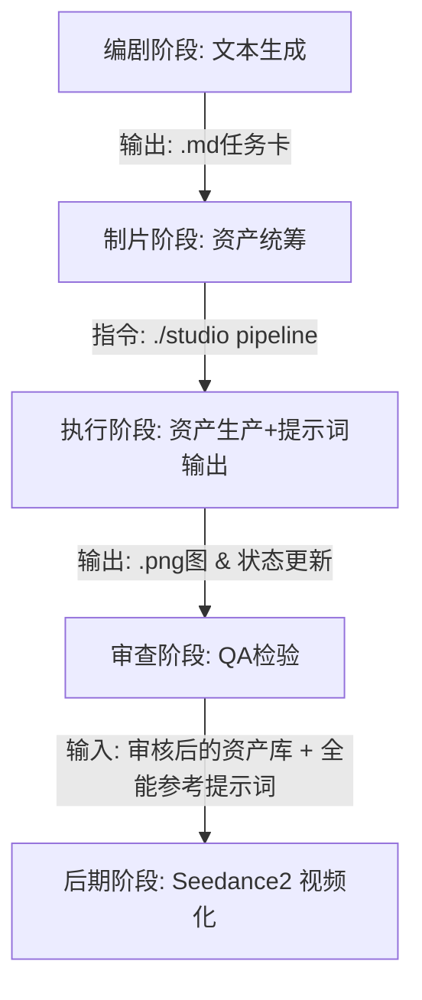

# 工业化漫剧全自动生产工作流 (v3 极简架构版)

> **项目代号**：无限强化·灵纹觉醒  
> **核心引擎**：RunningHub (Banana2 强一致性模型) + Seedance 2.0 (多模态视频生成)  
> **架构理念**：黑盒化流转，用极简命令 (`./studio`) 隐藏所有繁杂的 API 对接、资产校验和状态同步逻辑。

---

## 一、 全局管线总览 (Pipeline Overview)

漫剧的工业化生产被我们压缩为 **5 个黑盒化阶段**，由 6 位核心 AI 代理（Agent）接力完成，人类制片人仅需扮演“决策者”和“发号施令者”。

> 当前项目的“自动流水线”暂时截止到 **资产量产 + 故事板生产包输出**。  
> `05-prompts/` 仅作为下游配套生成说明与实验记录；`Seedance2 视频化 / 剪辑 / 审片` 等节点暂时保留规范与目录，但不纳入自动化执行，待即梦/视频平台具备一键化能力后再恢复。

---

## 二、 阶段拆解与自动化流转详情

### 阶段 1：剧本与设定解构 (Writer & Director)
**核心动作**：将网文/大纲拆解为 AI 可读的结构化指令。
1. **产出内容**：
   - 角色/场景/道具设定卡（位于 `05-prompts/runninghub/standard-api/`）。
   - 单集分镜脚本表（例如 `ep001-shots.md`，精确到每一镜的机位、动作、表情）。
2. **自动化亮点**：人类无需手写繁琐的 Midjourney 咒语，编剧 Agent 会用自然语言写出 `baseline`，后续脚本会自动为其挂载复杂的 `style_anchor` (风格锚点)。

### 阶段 2：资产自动化量产 (Studio & Librarian)
**核心动作**：将设定卡与分镜脚本，转化为高清、高一致性的物理图像资产。
1. **执行指令**：
   - 制片人敲击 `./studio gen-char / gen-scene / gen-prop`，生成角色/场景/道具资产。
   - 资产齐备后，敲击 `./studio gen-fullref 002 4` 直接产出 Seedance 2.0 全能参考提示词（不要求先生成分镜图）。
2. **底层自动化链路 (Blackbox)**：
   - **读取与挂载**：`auto_generate_assets.py` 自动扫描剧本，提取提示词，并**自动上传全局唯一风格锚点图 (v3-3.png)** 以锁定画风。
   - **Banana2 引擎投递**：跳过复杂的参数组装，直接向 RunningHub 投递 3 节点强控任务。
   - **自动落盘**：图片生成后自动下载，重命名并分发至 `06-generated/images/`（characters/scenes/props）。
   - **状态自反馈**：Librarian 钩子触发，自动修改 `asset-index.md` 或 `第1话总执行队列.md`，把进度条打上 `✅ 已生成`。
3. **产出内容**：
   - 核心角色的多视图设定草图。
   - 场景与核心道具图。
   - 故事板生产包：分镜表、导演故事板图、Panel 时长、连续性卡、资产引用矩阵、参考图职责矩阵和视频模型适配说明。
   - 可选下游配套生成说明（仅服务最终视频生成，不作为中游主交付）。

### 阶段 3：资产体检与 QA (Reviewer)
**核心动作**：确认生成的素材没有崩坏（如手指错误、穿模）。
1. **执行指令**：`./studio doctor`
2. **产出内容**：终端秒级打印出当前各项资产的物理文件数量，对比任务单，找出漏生成的死角。

---

## 三、 终极冲刺：如何将产出资源导入 Seedance 2.0 生成视频？

> 注意：本项目当前不具备“即梦/视频平台一键化”，以下内容仅作为**手动执行指南**与未来自动化的占位规范，不纳入当前自动流水线。

**进入 Seedance 2.0 后的自动化组装流：**

1. **全能参考 15 秒片段化 (All-in-One Reference, 15s)**：
   - 适用：需要一次性生成“15 秒片段”（宣发/预告/片段样片），或需要复刻动作/运镜/转场节奏；镜头数按剧本节奏、情绪密度、动作复杂度和画面读点设定，不套固定数量。
   - 输入：默认直接使用角色三视图 + 场景氛围图 + 道具图组成参考清单（不依赖分镜图）。
   - 输出：在 `05-prompts/seedance/ep*-fullref-15s.md` 产出统一模块（参考图清单 + Shot1..N + 技术参数 + 情绪曲线 + 使用说明），直接粘贴到 Seedance 2.0 的“全能参考”入口执行。
   - 自动化入口：`./studio gen-fullref 002 4`（自动生成骨架并根据资产库填充参考图清单）
   - 关键原则：参考图决定静态事实，提示词只写动态变化、运镜与衔接；素材职责必须写清，避免“多素材抢权”导致漂移。

2. **（可选增强）垫图驱动 (Image-to-Video)**：
   - 当你额外产出了 `comic-panels` 静帧分镜图，可把每个 Shot 的首帧替换为对应 panel，以进一步锁定构图与层级。
   - 注意：它是增强项，不是前置条件；不允许因为缺少 panels 阻塞全能参考提示词输出。

（以上已覆盖全能参考与可选增强的垫图驱动。）

---

## 四、 制片人视角：您的完美工作体验

从今天起，您作为制片人，不需要懂 API，不需要写代码，不需要复制粘贴提示词，甚至不需要手动打钩记进度。

您的工作只剩下 3 步：
1. 告诉 AI 编剧：“写第 2 话的剧本”。
2. 在终端敲下：“`./studio gen-all`”产出角色/场景/道具资产。
3. 再敲下：“`./studio pipeline 002 纪实克制`”，自动完成 Phase1-3前置检查→（可选）补齐 fullref→提示词输出→自动校验，然后把输出粘贴到 Seedance 2.0 执行。

**漫剧工业化，至此真正闭环！**
